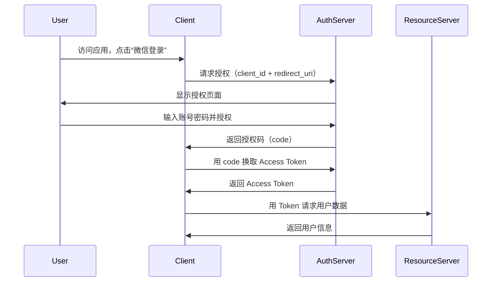
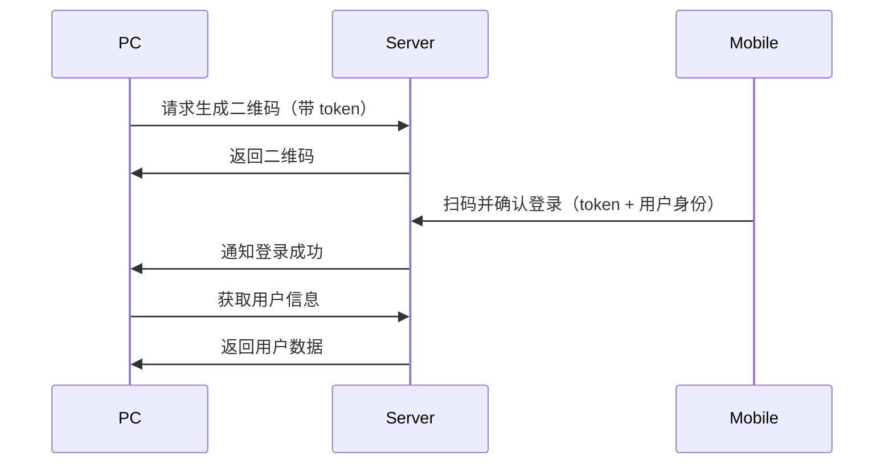
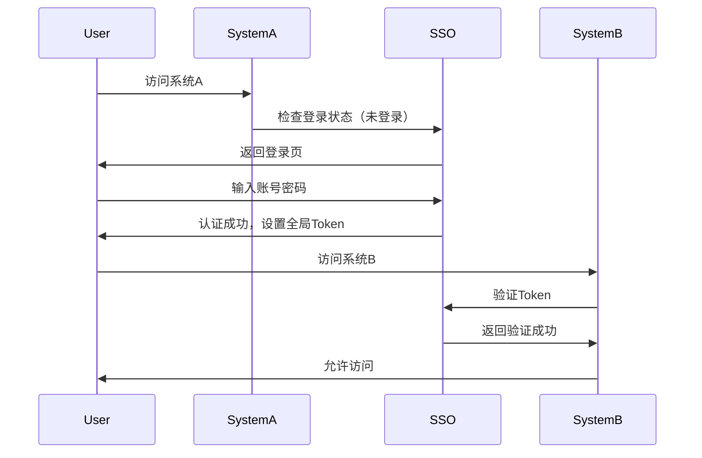

## **1. OAuth 2.0**

### **（1）是什么？**

OAuth 2.0 是一种 **授权框架**，允许第三方应用在用户授权后访问其资源（如 Google、微信、GitHub 账号数据），而无需提供密码。

### **（2）机制流程**

1. **用户** 访问 **第三方应用**（Client），点击“使用 XX 登录”（如微信登录）。
2. **第三方应用** 向 **授权服务器**（Authorization Server）发起授权请求（带 `client_id` 和 `redirect_uri`）。
3. **授权服务器** 返回 **授权页面**，用户输入账号密码并同意授权。
4. **授权服务器** 返回 **授权码（Authorization Code）** 给第三方应用。
5. **第三方应用** 用 **授权码** 向 **授权服务器** 换取 **访问令牌（Access Token）**。
6. **第三方应用** 使用 **Access Token** 访问 **资源服务器**（如获取用户微信头像、昵称）。
7. **资源服务器** 返回用户数据。

### **（3）优缺点**

| **优点** | **缺点** |
|----------|----------|
| 用户无需向第三方暴露密码 | 实现较复杂 |
| 支持细粒度权限控制（如仅读取头像） | 可能被钓鱼攻击 |
| 适用于开放平台（如微信、Google） | Token 可能泄露 |

### **（4）使用场景**

- **社交账号登录**（微信、Google、GitHub 登录）
- **API 授权**（如小程序调用微信支付）
- **第三方数据访问**（如允许淘宝读取支付宝收货地址）

---

## **2. 二维码扫码登录**

### **（1）是什么？**

用户扫描二维码后，**手机端确认登录**，PC/Web 端自动完成认证（如微信 PC 版登录）。

### **（2）机制流程**

1. **PC 端** 访问网站，生成 **临时二维码**（带唯一 `token`）。
2. **用户** 用手机扫码（如微信扫一扫）。
3. **手机端** 向服务器发送扫码确认（`token` + 用户身份）。
4. **服务器** 验证 `token`，并通知 **PC 端** 登录成功。
5. **PC 端** 获取用户信息，完成登录。

### **（3）优缺点**

| **优点** | **缺点** |
|----------|----------|
| 无需输入密码，安全便捷 | 依赖手机端 |
| 防钓鱼（二维码动态变化） | 网络延迟可能影响体验 |
| 适用于跨设备登录 | 需安装对应 App |

### **（4）使用场景**

- **微信/支付宝 PC 端登录**
- **企业办公软件**（如飞书、钉钉扫码登录）
- **智能设备绑定**（如智能电视登录）

---

## **3. 单点登录（SSO）**

### **（1）是什么？**

SSO (Single Sign On) 单点登录是一种身份验证机制，允许用户只登录一次，就可以访问多个相关但独立的系统。（如 Google 账号登录 YouTube、Gmail）

### **（2）机制流程**

1. **用户** 访问 **系统 A**，未登录则跳转至 **SSO 认证中心**。
2. **SSO 认证中心** 返回登录页，用户输入账号密码。
3. **认证通过** 后，SSO 生成 **全局 Token**，并存储到 **Cookie**。
4. **用户** 访问 **系统 B**，系统 B 带着 token 请求，向 **SSO 认证中心** 验证 Token。
5. **验证通过** 后，系统 B 允许访问，无需再次登录。

### **（3）优缺点**

| **优点** | **缺点** |
|----------|----------|
| 一次登录，多系统通行 | 实现复杂（需统一认证中心） |
| 提升用户体验 | 单点故障风险（SSO 挂了所有系统受影响） |
| 适用于企业内部系统 | 需各系统信任 SSO |

### **（4）使用场景**

- **企业内网**（如微软 AD 域登录）
- **Google 生态**（Gmail、YouTube、Drive）
- **大学校园系统**（选课系统、图书馆系统）

---

## **总结对比**

| **技术**    | **核心思想**   | **适用场景**    |
| --------- | ---------- | ----------- |
| **OAuth** | 授权第三方访问资源  | 社交登录、API 调用 |
| **二维码登录** | 跨设备扫码认证    | PC+ 移动端联动登录 |
| **SSO**   | 一次登录，多系统通行 | 企业内部系统      |
