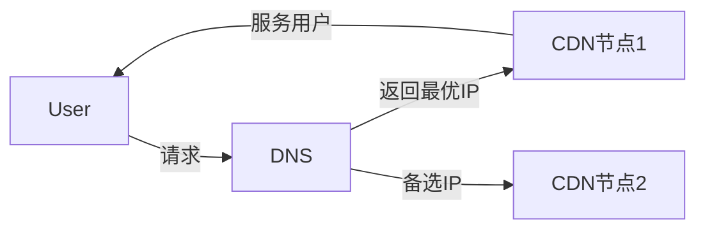
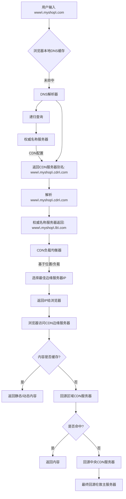
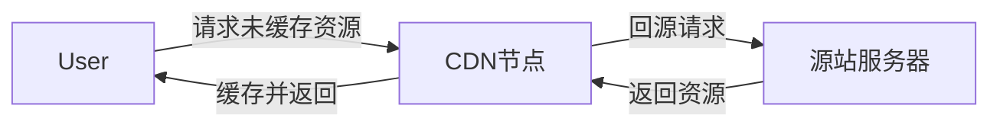

> Q: CDN 回源、预热、刷新；CDN 负载均衡

### CDN 是什么

CDN（Content Delivery Network）内容分发网络，是指分布在不同地理位置的服务器（也称为边缘服务器），可根据用户 IP 等快速选择就近节点，达到快速分发内容的目的。



### CDN 架构和原理

![[Pasted image 20250615000538.png|330]]

这个 GSLB 的主要功能就是：当用户想去访问网站的时候，根据就近原则，选择一个距离它最近的缓存节点，为用户提供内容。

简单来说就是请求转发，转发到最近（或许是最空闲）的站。

GSLB 转发机制有三种实现：

- **基于 DNS 解析**
- 基于 HTTP 重定向（主流应用层协议为 HTTP）
- 基于 IP 路由。

业界实现转发的主流技术是 **DNS 解析**，因为 DNS 有缓存功能和负载均衡能力，能天然减轻 GSLB 的压力。


基于 DNS 解析具体有三种实现方式：

- 利用 CNAME 实现负载均衡
- 将 GSLB 作为权威 DNS 服务器
- 将 GSLB 作为权威 DNS 服务器的代理服务器

业界最多是使用 CNAME 方式来实现负载均衡，实现简单且不需要修改公共 DNS 系统配置。

> 利用 CNAME 如果实现 CDN？

简单举个例子，比如之前网站网址是 `www.netitv.com.cn`，此时进行要 cdn 改造，那么将之前的网站网址作为 GSLB  服务域名的 CNAME，用户访问 `www.netitv.com.cn`，经过 CNAME 解析会映射到 GSLB 地址 `www.netitv.cdn.com.cn` 上，然后 GSLB 基于 DNS 协议可以进行后续的负载均衡操作，选择合适的 IP 返回给用户。

具体如下图所示，图来自《CDN 技术详解》：
![[Pasted image 20250615004148.png]]

---

### 工作流程

> 和 DNS 解析配合使用

![[Pasted image 20250615004913.png|500]]


- 在浏览器中输入 `www.myshop.com` ，浏览器在本地 DNS 缓存中查找域名。
- 如果本地 DNS 缓存中不存在该域名，浏览器会转到 DNS 解析器解析该域名。DNS 解析器通常位于互联网服务提供商 (ISP) 中。
- DNS 解析器对域名进行递归解析。最后，它会请求权威名称服务器解析域名。
- 如果不使用 CDN，权威名称服务器会返回 `www.myshop.com` 的 IP 地址。但使用 CDN 后，权威名称服务器会有一个别名指向 `www.myshop.cdn.com`（CDN 服务器的域名）。
- DNS 解析器要求权威名称服务器解析 `www.myshop.cdn.com`。
- 权威名称服务器返回 CDN 负载平衡器的域名 `www.myshop.lb.com`。
- DNS 解析器要求 CDN 负载平衡器解析 `www.myshop.lb.com`。负载平衡器根据用户的 IP 地址、用户的 ISP、请求的内容和服务器负载选择最佳 CDN 边缘服务器。
- CDN 负载均衡器将 CDN 边缘服务器的 IP 地址返回 `www.myshop.lb.com`。
- 得到了要最近的的实际 IP 地址， DNS 解析器会将 IP 地址返回给浏览器。
- 浏览器访问 CDN 边缘服务器加载内容，缓存在 CDN 服务器上的内容有两种：静态内容和动态内容。前者包括静态页面、图片和视频；后者包括边缘计算的结果。
- 如果边缘 CDN 服务器缓存中没有该内容，则回源到区域 CDN 服务器。如果仍未找到内容，则向上回源到中央 CDN 服务器，直至转到原点 -- 伦敦网络服务器。

这就是所谓的 CDN 分配网络，其中的服务器按地理位置部署。



---

### 使用实践 ⭐️

#### CDN 回源（Origin Fetch）

**定义**：当 CDN 边缘节点无缓存或缓存过期时，向源站（Origin Server）请求资源。

**工作流程**：



**关键点**：
- **触发条件**：首次访问、缓存过期、强制回源（如动态内容）。
- **优化策略**：
  - **分片回源**：大文件分块回源，减少源站压力。
  - **协议优化**：CDN 与源站间使用 HTTP/2 或 QUIC 加速。
  - **智能回源**：根据源站负载选择最优回源路径。

#### CDN 预热（Preload）

**定义**：主动将资源推送到 CDN 边缘节点，避免首次访问时回源延迟。

**典型场景**：
- 新版本发布前，预缓存静态资源（如 JS/CSS），防止用户同一时间回源造成压力。
- 大型活动前预加载热门内容（如直播、电商促销）。

**实现方式**：

```bash
# 通过 API 或控制台手动提交预热任务
curl -X POST "https://api.cdn.com/preload" \
  -H "Content-Type: application/json" \
  -d '{"urls": ["https://example.com/image.jpg"]}'
```

**优势**：
- **首屏加速**：用户首次访问即命中缓存。
- **降低源站压力**：避免突发流量冲击。

#### CDN 刷新（Purge）

**定义**：强制删除 CDN 边缘节点的缓存，使后续请求回源获取最新内容。

**使用场景**：
- 旧版本资源过期，需要更新（如修改了 `style.css`）。
- 紧急修复错误内容（如删除敏感信息）。

**操作类型**：

| 类型         | 作用范围       | 示例                            |
| ---------- | ---------- | ----------------------------- |
| **URL 刷新** | 删除指定文件的缓存  | `https://example.com/a.jpg`   |
| **目录刷新**   | 删除某目录下所有缓存 | `https://example.com/static/` |
| **全站刷新**   | 清空所有缓存（慎用） | 整个域名                          |

**API 示例**：

```bash
# 刷新单个 URL
curl -X POST "https://api.cdn.com/purge" \
  -H "Content-Type: application/json" \
  -d '{"urls": ["https://example.com/a.jpg"]}'
```

### 一些场景

[[如何防止缓存在 CDN 上的视频被盗版]]
