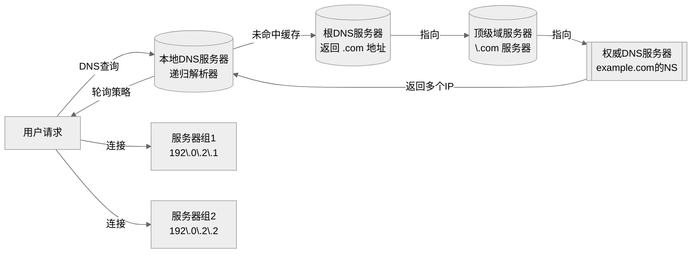
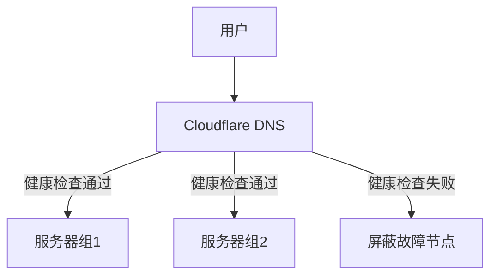

DNS 负载均衡是一种**通过 DNS 解析过程将用户请求分散到多个服务器**的技术，核心原理是**让单个域名返回多个 IP 地址**，实现流量分配和故障转移。

---

### 工作原理



1. **域名配置多条 A/AAAA 记录**

   ```dns
   www.example.com.  300  IN  A  192.0.2.1
   www.example.com.  300  IN  A  192.0.2.2
   www.example.com.  300  IN  A  192.0.2.3
   ```

2. **用户发起 DNS 查询**
   - DNS 服务器返回 **IP 地址列表**（非单个 IP）

3. **客户端选择 IP**
   - 客户端（浏览器/操作系统）**随机或按顺序**选择一个 IP 连接

---

### 核心负载均衡策略

| 策略                | 原理                                                                 | 场景                     |
|---------------------|----------------------------------------------------------------------|--------------------------|
| **轮询（Round Robin）** | 按顺序返回 IP 列表（如：第一次返回 [1,2,3]，第二次返回 [2,3,1]）        | 服务器性能均等时         |
| **加权轮询**          | 高性能服务器分配更高权重（如 IP1: 权重 3, IP2: 权重 1）                    | 服务器配置不均时         |
| **地理定位**          | 根据用户位置返回最近的 IP（需 EDNS 协议传递客户端子网信息）             | 全球分布式部署           |
| **最小连接数**        | DNS 服务器监控后端连接数，返回压力最小的 IP（需动态 DNS 支持）          | 避免服务器过载           |

---

### 关键优势

1. **高可用性**
   - 自动屏蔽故障节点（客户端跳过不可达 IP）
   - 示例：若 `192.0.2.1` 宕机，客户端自动尝试 `192.0.2.2`

2. **零成本扩展**
   - 添加新服务器只需增加 DNS 记录
   - 无需额外负载均衡硬件

3. **全球流量调度**
   - CDN 核心基础：将用户导向最近节点

   ```dns
   ; 美国用户返回
   www.example.com.  IN  A  104.16.1.1
   ; 亚洲用户返回
   www.example.com.  IN  A  101.101.101.101
   ```

4. **简单易用**
   - 云服务商（AWS Route53、阿里云 DNS）一键配置

---

### 局限性及解决方案

| 问题                        | 解决方案                                                                 |
|-----------------------------|--------------------------------------------------------------------------|
| **DNS 缓存导致不均衡**       | 缩短 TTL（如 60 秒），但增加 DNS 查询压力                                 |
| **无法感知实时服务器状态**   | 结合健康检查（如 AWS Route53 健康监测）                                  |
| **客户端无视多个 IP**        | 75% 的客户端会尝试第二个 IP（RFC 8305）                                  |
| **粒度较粗**                | 配合其他负载均衡器（如 Nginx）做二次调度                                 |

---

### 典型应用场景

1. **大型网站入口**

   ```dns
   ; Facebook 的 DNS 负载均衡
   www.facebook.com.  IN  A  157.240.1.35
   www.facebook.com.  IN  A  157.240.10.35
   ```

2. **CDN 节点调度**
   - 用户访问 `image.cdn.com` → DNS 返回最近的 CDN 节点 IP

3. **微服务网关**
   - 服务发现：`service.api.com` 动态解析到多个实例 IP

4. **抗 DDoS 攻击**
   - 云防护服务（如 Cloudflare）通过 Anycast DNS 分散攻击流量

---

### 配置示例（Cloudflare）



> 💡 **现代演进**：云服务商已实现智能 DNS 负载均衡，如 AWS Route53 的 **延迟路由**（Latency Routing）和 **故障转移**（Failover）。

---

### 总结

- **本质**：DNS 层面对用户请求的**第一级流量分配**
- **核心价值**：低成本实现高可用和地理扩展
- **最佳实践**：
  - 结合短 TTL（60-300 秒）
  - 启用健康检查
  - 搭配应用层负载均衡器（如 Nginx）
