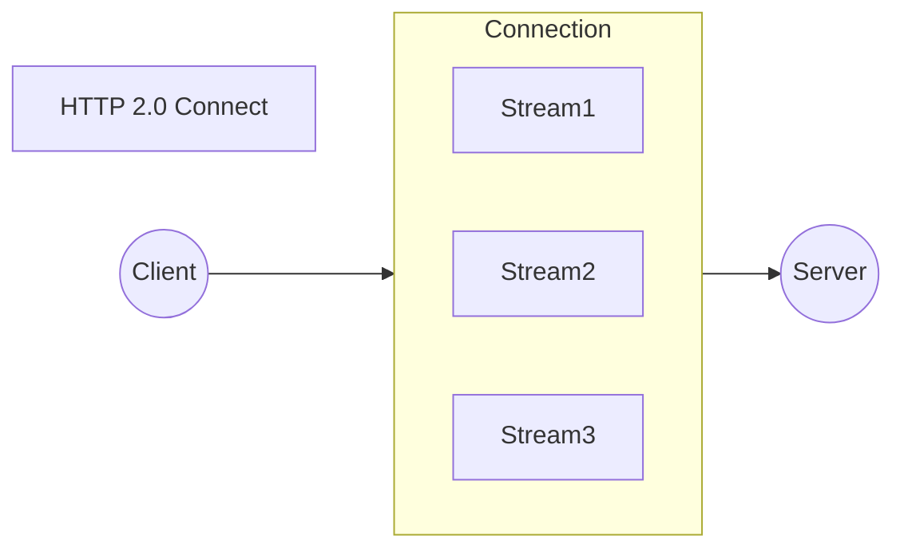

## HTTP 有哪些版本

**HTTP/0.9 - 单行协议**
- 只有 GET 请求行，无请求头和请求体
- 只能传输 HTML 文件，以 ASCII 字符流返回
- 无响应头

**HTTP/1.0 - 多类型支持**
- 支持多种文件类型传输，不限于 ASCII 编码
- 引入请求头和响应头 ( key-value 形式)
- 每个请求都需要建立新的 TCP 连接

**HTTP/1.1 - 持久连接** [目前最普遍]
- 默认开启持久连接 (keep-alive)：**一个 TCP 连接可串行多个 HTTP 请求（不能并行）**
- 存在队头阻塞问题：前面的请求阻塞会影响后续请求。**浏览器通常对同一域名建立 6~8 个 TCP 连接**，以绕过 HTTP/1.1 的队头阻塞
- 引入 Host 字段，支持虚拟主机
- 引入 Chunk transfer 机制处理动态内容长度

**HTTP/2.0 - 多路复用**
- 一个域名只使用**一个 TCP 长连接**
- 引入二进制分帧层，实现一个连接多路复用
- 可对请求设置优先级
- 引入 HTTPS(HTTP + TLS) 加密

**HTTP/3.0 - QUIC 协议**
- 基于 **UDP 协议**而非 TCP
- 实现了类似 TCP 的流量控制和可靠传输
- 集成 TLS 加密
- 实现多路复用
- 解决 TCP 队头阻塞问题

## HTTP/2

> 问题：HTTP2 有哪些改进

HTTP/2 相比于 HTTP/1，可以说是大幅度提高了网页的性能。

在 HTTP/1 中，为了性能考虑，会引入雪碧图、将小图内联、使用多个域名等的方式。

这都是因为浏览器限制了同一个域名下的请求数量（Chrome 下一般是限制六个连接），当页面中需要请求很多资源的时候，队头阻塞（Head of line blocking）会导致在达到最大请求数量时，剩余的资源需要等待其他资源先请求完成。

在 HTTP/2 中引入了多路复用的技术，这个技术可以只通过一个 TCP 连接就可以传输所有的请求数据。
- 解决了浏览器限制同一个域名下的请求数量的问题
- 更容易实现全速传输，因为新开一个 TCP 连接需要慢慢提升传输速度

### 二进制传输

HTTP/2 中所有加强性能的核心点在于此。在之前的 HTTP 版本中，是通过文本的方式传输数据。
HTTP/2 中引入了二进制的编码机制，所有传输的数据都会被分割，并采用二进制格式编码。
![[Pasted image 20250613164731.png||500]]

### 多路复用

在 HTTP/2 中，有两个非常重要的概念，分别是帧（frame）和流（stream）。
- 帧代表最小的数据单位，每个帧会标识出该帧属于哪个流
- 流也就是多个帧组成的数据流

多路复用，就是在一个 TCP 连接中可以存在多条流，并行发送多个请求。对端会通过帧中的标识，知道属于哪个请求。通过这个技术，可以避免 HTTP 旧版本中的队头阻塞问题，极大的提高传输性能。

### Header 压缩

在 HTTP/1 中，使用文本的形式传输 header，在 header 携带 cookie 的情况下，可能每次都需要重复传输几百到几千的字节。

在 HTTP /2 中，使用了 HPACK 压缩格式对传输的 header 进行编码，减少了 header 的大小。
并在两端维护了索引表，用于记录出现过的 header，后面在传输过程中就可以传输已经记录过的 header 的键名，对端收到数据后就可以通过键名找到对应的值，减少传输重复值。

### 服务端 Push

在 HTTP/2 中，服务端可以在客户端某个请求后，主动推送其他资源。

可以想象以下情况，某些资源客户端是一定会请求的，这时就可以采取服务端 push 的技术，提前给客户端推送必要的资源，这样就可以相对减少一点延迟时间。

当然在浏览器兼容的情况下也可以使用 prefetch。

## HTTP/3

> 问题：基于 UDP 的 HTTP3 是如何保证可靠的？

HTTP/2 最大的问题是底层支撑的 TCP 协议的问题：
- HTTP/2 使用多路复用，一般同一域名下只需要使用**一个** TCP 连接。
- 如果当这个连接中出现了丢包的情况，整个 TCP 就会开始等待重传，也就导致后面的所有数据都被阻塞。

这种情况下，HTTP/2 的表现情况反倒不如 HTTP/1：
- HTTP/1 开启多个 TCP 连接，出现 TCP 等待重传也只会影响一个连接，剩余的 TCP 连接还可以正常传输

修复这个问题就要修改 TCP，但不太现实。
所以 Google 新开发了一个**基于 UDP 协议的 QUIC 协议，并实现类似 TCP 的流量控制和可靠传输**。
最终 QUIC 落地在了 HTTP/3。

### QUIC

UDP 协议虽然效率很高，但是并不是那么的可靠。QUIC 在原本的基础上新增了很多功能：
- 多路复用
- 0-RTT
- 使用 TLS1.3 加密
- 流量控制、有序交付、重传

**多路复用**

虽然 HTTP/2 支持了多路复用，但是 TCP 协议终究是没有这个功能的。QUIC 原生就实现了这个功能，并且传输的单个数据流可以保证有序交付且不会影响其他的数据流，这样的技术就解决了之前 TCP 存在的问题。

并且 QUIC 在移动端的表现也会比 TCP 好。因为 TCP 是基于 IP 和端口去识别连接的，这种方式在多变的移动端网络环境下是很脆弱的。但是 QUIC 是通过 ID 的方式去识别一个连接，不管你网络环境如何变化，只要 ID 不变，就能迅速重连上。

**0-RTT**

通过使用类似 TCP 快速打开的技术，缓存当前会话的上下文，在下次恢复会话的时候，只需要将之前的缓存传递给服务端验证通过就可以进行传输了。

**纠错机制**

假如说这次我要发送三个包，那么协议会算出这三个包的异或值并单独发出一个校验包，也就是总共发出了四个包。

当出现其中的非校验包丢包的情况时，可以通过另外三个包计算出丢失的数据包的内容。

当然这种技术只能使用在丢失一个包的情况下，如果出现丢失多个包就不能使用纠错机制了，只能使用重传的方式了。
