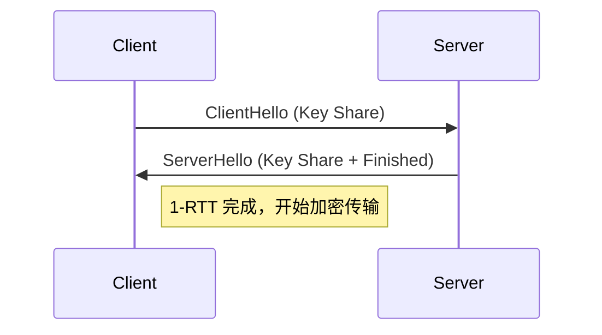

HTTPS（HTTP Secure）通过 HTTP 通信，并依赖 **TLS（Transport Layer Security）** 协议进行信息加密。

TLS 协议位于传输层之上，应用层之下，算是一个接口层。目前，TLS 1.2 和 TLS 1.3 是主流版本。

### 对称和非对称加密

可逆的加密方式分为两种：对称加密和非对称加密。在 TLS 中都使用了。

**对称加密** ：

对称加密就是两边拥有相同的秘钥，两边都知道如何将密文加密解密。

这种加密方式固然很好，但是问题就在于如何让双方知道秘钥。因为传输数据会走网络，如果将秘钥通过网络的方式传递，一旦秘钥被截获就没有加密的意义了。

**非对称加密** ：

公钥私钥成对匹配。公钥所有人都可以知道，可以将数据用公钥加密，但是将数据解密必须使用私钥解密，而私钥只有分发公钥的一方才知道。

这种加密方式就可以完美解决对称加密存在的问题。假设现在两端需要使用对称加密，那么在这之前，可以先使用非对称加密交换秘钥。

简单流程如下：
- 首先服务端将公钥公布出去，那么客户端也就知道公钥了。
- 接下来客户端创建一个秘钥，然后通过公钥加密并发送给服务端，服务端接收到密文以后通过私钥解密出正确的秘钥，这样两端就都安全地知道秘钥是什么了。

### TLS 1.2 握手过程

> **RTT（Round-Trip Time）**：数据从客户端发送到服务器并返回所需的时间（即网络往返延迟）

首次进行 TLS 1.2 协议传输需要 2 个 RTT ，后续过程可以通过 Session Resumption 减少到一个 RTT。

**TLS 握手过程如下图：**

![[Pasted image 20250613131237.png|tls 握手|500]]


客户端发送一个随机值以及需要的协议和加密方式。

服务端收到客户端的随机值，自己也产生一个随机值，并根据客户端需求的协议和加密方式来使用对应的方式，并且发送自己的证书（如果需要验证客户端证书需要说明）

客户端收到服务端的证书并验证是否有效，验证通过会再生成一个随机值，通过服务端证书的公钥去加密这个随机值并发送给服务端，如果服务端需要验证客户端证书的话会附带证书

服务端收到加密过的随机值并使用私钥解密获得第三个随机值，这时候两端都拥有了三个随机值，可以通过这三个随机值按照之前约定的加密方式生成密钥，接下来的通信就可以通过该密钥来加密解密

- 在 TLS 握手阶段，两端使用非对称加密的方式来通信
- 但是因为非对称加密损耗的性能比对称加密大，所以在正式传输数据时，两端使用对称加密的方式通信。

简述版：[[HTTP：简述 HTTPS 过程]]

### TLS 1.3

#### 核心改进：1-RTT

- 预共享密钥（PSK）：客户端在首次请求时即发送密钥材料（Key Share），省去一轮等待
- 合并消息：TLS 1.2 的 `ServerKeyExchange` 和 `ServerHelloDone` 被合并到一次的 `ServerHello`
- 安全性增强：
	- 移除 RSA 密钥交换步骤（改用 ECDHE，支持前向保密）
	- 废弃 RC4、SHA-1、CBC 模式等不安全算法

#### 握手过程

**步骤 1：客户端发起连接**
- 发送 `ClientHello`，包含：
  - 支持的加密套件（如 AES-256-GCM）。
  - **密钥共享（Key Share）**：客户端生成的临时公钥（ECDHE）。

**步骤 2：服务器响应**
- 返回 `ServerHello`，包含：
  - 选定的加密套件。
  - 服务器的临时公钥（ECDHE）。
  - **Finished** 消息（验证握手完整性）。
- **此时双方已计算共享密钥**，可开始加密通信。



#### 如何查看协议版本

```sh
openssl s_client -connect example.com:443 -tls1_3  # 测试 TLS 1.3
openssl s_client -connect example.com:443 -tls1_2  # 测试 TLS 1.2
```

或 **浏览器 DevTools**：按 `F12` → **Security** 标签 → 查看 TLS 版本

![[Pasted image 20250613134552.png|查看tls 版本|500]]

#### 如何升级到 1.3

```nginx
ssl_protocols TLSv1.2 TLSv1.3;
ssl_prefer_server_ciphers on;
ssl_ciphers 'TLS_AES_256_GCM_SHA384:TLS_CHACHA20_POLY1305_SHA256:TLS_AES_128_GCM_SHA256';
```
