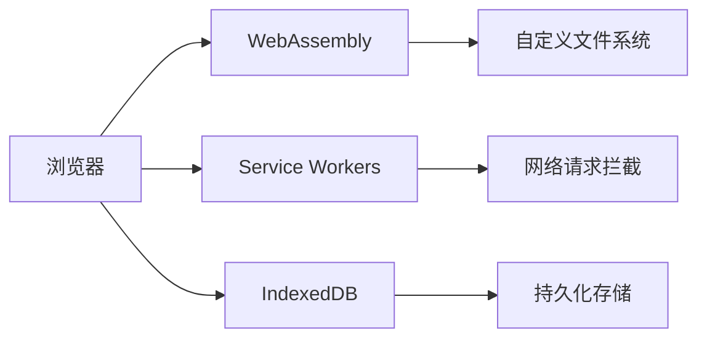
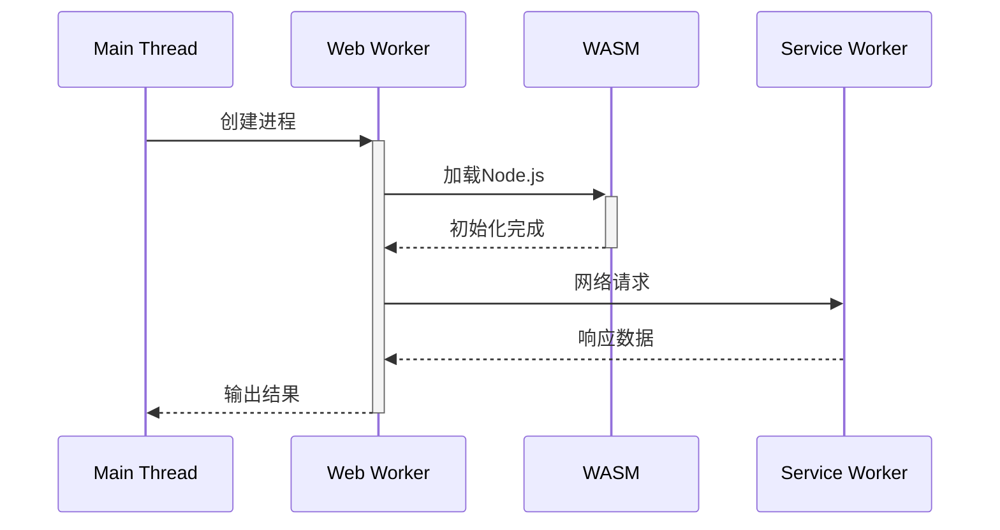

WebContainer 是一种革命性的浏览器内运行环境，它允许在浏览器标签页中直接运行完整的 Node.js 应用。这项技术由 StackBlitz 团队开发，代表了前端开发环境的最新演进方向。

## 一、核心架构原理

### 1. 技术栈组成



### 2. 关键技术实现

- **WebAssembly 编译**：将 Node.js 运行时编译为 WASM
- **虚拟文件系统**：在内存中模拟完整的 Unix 文件结构
- **网络层劫持**：通过 Service Worker 拦截所有 HTTP 请求
- **进程模拟**：使用浏览器 Web Workers 模拟 Node.js 进程模型

## 二、核心特性展示

### 1. 完整 Node.js 环境

```javascript
// 在浏览器中运行的真实 Node.js 代码
const fs = require('fs');
const express = require('express');

fs.writeFileSync('test.txt', 'Hello WebContainer!');
const app = express();
app.get('/', (req, res) => res.send(fs.readFileSync('test.txt')));
app.listen(3000);
```

### 2. 实时依赖管理

```bash
# 浏览器内执行 npm 命令
npm install express lodash
# 依赖会被存储在虚拟 node_modules 中
```

### 3. 开发工作流示例

```javascript
import { WebContainer } from '@webcontainer/api';

// 初始化容器
const wc = await WebContainer.boot();

// 创建项目文件
await wc.mount({
  'package.json': `{
    "name": "demo",
    "dependencies": {
      "express": "^4.17.0"
    }
  }`,
  'index.js': `const express = require('express');`
});

// 安装依赖
const install = await wc.spawn('npm', ['install']);
await install.exit;

// 启动服务器
const server = await wc.spawn('node', ['index.js']);
server.output.pipeTo(new WritableStream({
  write(data) { console.log(data); }
}));
```

## 三、与传统方案的对比

| 特性                | WebContainer       | 本地 Node.js       | 在线 IDE           |
|---------------------|--------------------|--------------------|--------------------|
| 运行环境            | 浏览器 WASM        | 系统原生           | 远程服务器         |
| 启动速度            | 3-5 秒              | 即时               | 10-30 秒            |
| 文件系统            | 虚拟文件系统       | 真实文件系统       | 远程文件系统       |
| 网络访问            | Service Worker 代理| 直接访问           | 服务器中转         |
| 依赖安装            | 浏览器内 npm       | 本地 npm           | 服务器端 npm       |
| 协作功能            | 内置实时协作       | 需要额外配置       | 部分支持           |

## 四、技术实现细节

### 1. 文件系统模拟

```javascript
class VirtualFS {
  constructor() {
    this.files = new Map();
    this.uid = 0;
    this.gid = 0;
    this.mode = 0o777;
  }
  
  writeFile(path, content) {
    this.files.set(path, {
      ino: Date.now(),
      content,
      uid: this.uid,
      gid: this.gid,
      mode: this.mode
    });
  }
}
```

### 2. 进程管理架构



### 3. 性能优化技术

- **模块预编译**：将常用 npm 包预编译为 WASM
- **懒加载**：按需加载 Node.js 核心模块
- **内存缓存**：使用 IndexedDB 缓存依赖项
- **差分同步**：只传输文件变更部分

## 五、应用场景

### 1. 教育领域

- **实时编程教学**：学生直接在浏览器完成 Node.js 练习
- **自动评分系统**：即时验证代码正确性

### 2. 企业应用

```javascript
// 公司内部工具链集成
const wc = await WebContainer.boot();
await wc.mount(await loadTemplate('react-starter'));

// 代码质量检查
const lint = await wc.spawn('npm', ['run', 'lint']);
lint.output.pipeTo(displayStream);

// 安全依赖检查
const audit = await wc.spawn('npm', ['audit']);
```

### 3. 开源协作

- **Issue 复现**：直接嵌入可交互的复现代码
- **文档示例**：文档中的可执行代码示例

## 六、限制与挑战

1. **性能瓶颈**：
   - 大型项目构建速度比本地慢 2-3 倍
   - 内存密集型操作容易触发浏览器限制

2. **系统访问限制**：

   ```javascript
   // 以下操作会失败
   const fs = require('fs');
   fs.writeFile('/etc/passwd', 'hack'); // 不允许访问真实系统
   ```

3. **兼容性问题**：
   - 部分 Native Addons 无法运行
   - 底层系统调用受限（如 fork()）

## 七、快速开始示例

```html
<!DOCTYPE html>
<html>
<head>
  <script type="module">
    import { WebContainer } from 'https://cdn.jsdelivr.net/npm/@webcontainer/api@1.0.0/dist/index.min.js';
    
    async function init() {
      const wc = await WebContainer.boot();
      await wc.mount({
        'index.js': `console.log('Hello from WebContainer!');`
      });
      
      const process = await wc.spawn('node', ['index.js']);
      process.output.pipeTo(new WritableStream({
        write(text) { document.getElementById('output').textContent += text; }
      }));
    }
    
    document.getElementById('run').addEventListener('click', init);
  </script>
</head>
<body>
  <button id="run">Run WebContainer</button>
  <pre id="output"></pre>
</body>
</html>
```

WebContainer 代表了云开发环境的未来方向，通过将完整的开发环境搬进浏览器，它正在重新定义开发者工具的形态和协作方式。随着 WASM 技术的进步，其性能差距将进一步缩小，有望成为主流的开发环境方案。
