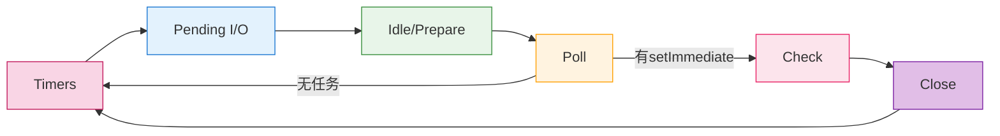

事件循环是 Node.js 实现异步操作的核心机制，它允许 Node.js 执行非阻塞 I/O 操作。Node.js 是单线程的，但通过事件循环机制可以实现高并发。

Node.js 的事件循环基于 libuv 实现，分为 6 个阶段，每个阶段按照顺序，处理特定类型的任务。如需更深入细节，可参考 [libuv 官方文档](http://docs.libuv.org/)

### **事件循环的六个阶段**



1. **timers（定时器阶段）**
   - 执行 `setTimeout` 和 `setInterval` 的回调
   - 检查是否有到期的定时器

2. **pending callbacks（待定回调阶段）**
   - 执行延迟到下一个循环迭代的 I/O 回调
   - 处理一些系统操作的回调（如 TCP 错误）

3. **idle, prepare（仅系统内部使用）**
   - 系统内部使用，不需要关注

4. **poll（轮询阶段）**
   - 检索新的 I/O 事件
   - 执行 I/O 相关的回调
   - 如果有必要会阻塞在这个阶段

5. **check（检查阶段）**
   - 执行 `setImmediate()` 的回调
   - 在 poll 阶段结束后立即执行

6. **close callbacks（关闭回调阶段）**
   - 执行关闭事件的回调
   - 如 `socket.on('close', …)`

### **微任务和宏任务**

#### **微任务（Microtasks）：**

- `process.nextTick()`（优先级最高）
- `Promise.then/catch/finally`
- `queueMicrotask()` 将微任务排队

#### **宏任务（Macrotasks）：**

- `setTimeout`
- `setInterval`
- `setImmediate` - （优先级最低，是在检查阶段）
- I/O 操作

#### **微任务执行时机**

Node.js v11+ 后，微任务的执行时机与浏览器对齐：

- **每个阶段**结束后，立即**检查并执行所有微任务**（与浏览器差不多一致，浏览器是一个宏任务结束后检查并执行所有微任务）。
- 微任务执行期间如果产生了新的微任务，会加入当前微任务队列的**末尾**，**继续执行清空** （与浏览器一致）

#### 特殊事项

1. **process.nextTick**
   - 不属于事件循环的任何阶段
   - **优先级最高**，在所有微任务之前执行。在每个阶段结束时、下个阶段开始前，必须优先执行
   - 过度使用可能导致 I/O 饥饿

2. **setImmediate vs setTimeout(fn, 0)**
   - setImmediate 优先级最低，因为它在检查阶段
   - 主模块中，二者 **执行顺序不确定**（因为当前事件循环可以处在六个阶段的任意一个）
   - I/O 回调中， `setImmediate` 比 setTimeout(fn, 0) 优先级更高。因为 check 阶段是紧跟在 poll 阶段后的

3. **定时器的精确性**
   - `setTimeout` 和 `setInterval` 的延时不能保证精确
   - 受进程繁忙程度影响

### **示例**

```js
console.log("1: 同步代码");

setTimeout(() => {
  console.log("2: setTimeout");
}, 0);

Promise.resolve().then(() => {
  console.log("3: Promise");
});

process.nextTick(() => {
  console.log("4: nextTick");
  Promise.resolve().then(() => {
    console.log("6: 微任务产生的微任务");
  });
});

setImmediate(() => {
  console.log("5: setImmediate");
});

// 输出顺序：
// 1: 同步代码
// 4: nextTick
// 3: Promise
// 6: 微任务产生的微任务
// 5: setImmediate
// 2: setTimeout

//注： 5,2 可能互换
```

### 最佳实践

1. 合理使用 `process.nextTick`，避免阻塞事件循环
2. 避免在关键任务中依赖定时器的精确性
3. I/O 操作中优先使用 `setImmediate` 而不是 `setTimeout`
4. 使用 Promise 或 async/await 处理异步操作
5. 注意内存泄漏，及时清理不需要的事件监听器
