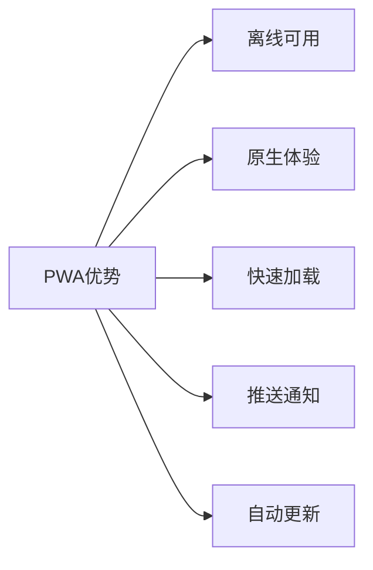
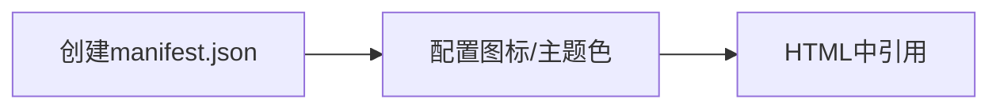

## 一、PWA (Progressive Web App) 核心优势



| 优势 | 说明 | 技术实现 |
|------|------|----------|
| **离线功能** | 通过 Service Worker 缓存核心资源 | Cache API |
| **安装到桌面** | 无需应用商店分发 | Web App Manifest |
| **媲美原生** | 全屏/启动画面/手势支持 | manifest.json 配置 |
| **推送通知** | 提高用户参与度 | Push API + Notification API |
| **性能优化** | 预缓存关键资源 | Workbox 库 |
| **跨平台** | 一次开发多端运行 | 响应式设计 |

## 二、快速转换 PWA 的 5 个步骤

### 1. 添加 Web App Manifest



```json
// manifest.json
{
  "name": "My PWA",
  "short_name": "PWA",
  "start_url": "/",
  "display": "standalone",
  "background_color": "#ffffff",
  "icons": [{
    "src": "icon-192.png",
    "sizes": "192x192",
    "type": "image/png"
  }]
}
```

```html
<link rel="manifest" href="/manifest.json">
```

### 2. 注册 Service Worker

```javascript
// 主线程注册
if ('serviceWorker' in navigator) {
  window.addEventListener('load', () => {
    navigator.serviceWorker.register('/sw.js')
      .then(registration => {
        console.log('SW registered');
      });
  });
}
```

### 3. 实现基础 Service Worker

```javascript
// sw.js - 缓存核心资源
const CACHE_NAME = 'v1';
const urlsToCache = [
  '/',
  '/styles.css',
  '/app.js'
];

self.addEventListener('install', event => {
  event.waitUntil(
    caches.open(CACHE_NAME)
      .then(cache => cache.addAll(urlsToCache))
  );
});

self.addEventListener('fetch', event => {
  event.respondWith(
    caches.match(event.request)
      .then(response => response || fetch(event.request))
  );
});
```

### 4. 添加离线回退页

```html
<!-- offline.html -->
<h1>您处于离线状态</h1>
<button onclick="location.reload()">重试</button>
```

```javascript
// 在sw.js中
self.addEventListener('fetch', event => {
  event.respondWith(
    caches.match(event.request)
      .then(response => response || fetch(event.request))
      .catch(() => caches.match('/offline.html'))
  );
});
```

### 5. 实现安装提示

```javascript
// 检测PWA安装条件
window.addEventListener('beforeinstallprompt', (e) => {
  e.preventDefault();
  const installBtn = document.getElementById('install-btn');
  installBtn.style.display = 'block';
  
  installBtn.addEventListener('click', () => {
    e.prompt();
    e.userChoice.then(choice => {
      if (choice.outcome === 'accepted') {
        console.log('用户同意安装');
      }
      installBtn.style.display = 'none';
    });
  });
});
```

## 三、进阶优化方案

### 1. 使用 Workbox 简化 SW

```javascript
// 引入Workbox
importScripts('https://storage.googleapis.com/workbox-cdn/releases/6.4.1/workbox-sw.js');

workbox.routing.registerRoute(
  ({request}) => request.destination === 'image',
  new workbox.strategies.CacheFirst()
);
```

### 2. 实现后台同步

```javascript
// 注册同步任务
navigator.serviceWorker.ready.then(registration => {
  document.getElementById('submit').addEventListener('click', () => {
    registration.sync.register('sync-data')
      .then(() => console.log('后台同步已注册'));
  });
});

// SW中处理
self.addEventListener('sync', event => {
  if (event.tag === 'sync-data') {
    event.waitUntil(sendDataToServer());
  }
});
```

### 3. 添加 Web Push 通知

```javascript
// 请求通知权限
Notification.requestPermission().then(permission => {
  if (permission === 'granted') {
    new Notification('欢迎使用PWA!');
  }
});

// SW中接收推送
self.addEventListener('push', event => {
  const data = event.data.json();
  self.registration.showNotification(data.title, {
    body: data.body,
    icon: '/icon.png'
  });
});
```

## 四、转换检查清单

1. **基础要求**：
   - HTTPS 环境
   - 响应式设计
   - 有效的 manifest 文件
   - 已注册的 Service Worker

2. **验证工具**：
   - Lighthouse 审计（Chrome DevTools）

   ```mermaid
   graph LR
       A[Lighthouse] --> B[PWA评分>80]
       B --> C[核心功能达标]
   ```

3. **发布准备**：
   - 不同网络条件测试
   - 多设备兼容性测试
   - 添加元标签

   ```html
   <meta name="theme-color" content="#4285f4">
   <link rel="apple-touch-icon" href="icon-192.png">
   ```

通过以上步骤，普通网页可在 1-2 天内转换为基本 PWA。建议逐步增强功能，优先保证核心体验离线可用。
