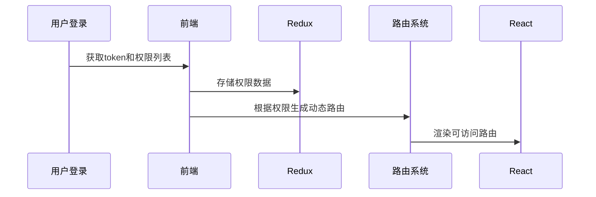
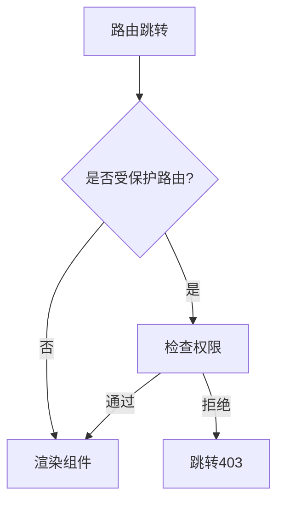

在 React 中实现动态路由和权限拦截确实与 Vue Router 有所不同，但可以通过以下几种方式实现类似的功能。以下是完整的解决方案：

---

## 一、React Router v6 动态路由 + 权限控制方案

### 1. 基础动态路由设置

```jsx
// src/routes/index.js
const routes = [
  {
    path: "/",
    element: <Layout />,
    children: [
      { index: true, element: <Home /> },
      { path: "public", element: <PublicPage /> },
      {
        path: "dashboard",
        element: <RequireAuth permissions={["dashboard_view"]} />,
        children: [
          { index: true, element: <Dashboard /> },
          { path: "settings", element: <Settings /> },
        ],
      },
    ],
  },
];

// 动态创建Router
function createRouter(routes) {
  return createBrowserRouter(routes);
}
```

### 2. 权限包装组件（替代路由守卫）

```jsx
// src/components/RequireAuth.jsx
import { useSelector } from "react-redux";
import { Navigate, useLocation } from "react-router-dom";

export default function RequireAuth({ children, permissions }) {
  const user = useSelector((state) => state.user);
  const location = useLocation();

  // 检查权限
  const hasPermission = permissions.every((perm) => user.permissions.includes(perm));

  if (!user.isAuthenticated) {
    return <Navigate to="/login" state={{ from: location }} replace />;
  }

  if (!hasPermission) {
    return <Navigate to="/403" replace />;
  }

  return children;
}
```

### 3. 动态路由加载方案

```jsx
// src/App.jsx
import { RouterProvider } from "react-router-dom";
import { useMemo } from "react";
import { usePermissions } from "./hooks/usePermissions";

function App() {
  const { permissions } = usePermissions();

  const router = useMemo(() => {
    const filteredRoutes = filterRoutesByPermission(allRoutes, permissions);
    return createRouter(filteredRoutes);
  }, [permissions]);

  return <RouterProvider router={router} />;
}
```

---

## 二、四种权限拦截实现方式

### 1. 包装组件模式（推荐）

```jsx
// 路由配置
const routes = [
  {
    path: "/admin",
    element: (
      <RequireAuth role="admin">
        <Admin />
      </RequireAuth>
    ),
  },
];

// 使用Outlet实现嵌套路由权限
function AdminLayout() {
  return (
    <RequireAuth role="admin">
      <Outlet /> {/* 所有子路由自动继承权限检查 */}
    </RequireAuth>
  );
}
```

### 2. 自定义 hook 拦截

```jsx
// useRouteGuard.js
import { useEffect } from "react";
import { useNavigate, useLocation } from "react-router-dom";

export function useRouteGuard(permission) {
  const navigate = useNavigate();
  const location = useLocation();
  const { hasPermission } = useAuth();

  useEffect(() => {
    if (!hasPermission(permission)) {
      navigate("/403", { state: { from: location }, replace: true });
    }
  }, [permission, hasPermission, navigate, location]);
}

// 在页面组件中使用
function AdminPage() {
  useRouteGuard("admin_access");
  return <div>Admin Content</div>;
}
```

### 3. 数据驱动动态路由

```jsx
// 后端返回的路由结构
const asyncRoutes = [
  {
    path: "/dashboard",
    component: "Dashboard",
    meta: { permission: "dashboard_view" },
  },
];

// 前端转换
function transformRoutes(apiRoutes) {
  return apiRoutes.map((route) => ({
    path: route.path,
    element: createElement(
      RequireAuth,
      { permissions: route.meta.permission },
      createElement(lazy(() => import(`@/pages/${route.component}`))),
    ),
  }));
}
```

### 4. 路由加载器方案（React Router 6.4+）

```jsx
// 使用loader进行权限检查
const router = createBrowserRouter([
  {
    path: '/admin',
    element: <Admin />,
    loader: async ({ request }) => {
      const user = await checkAuth()
      if (!user.permissions.includes('admin')) {
        throw new Response('Forbidden', { status: 403 })
      }
      return null
    }
  }
])

// 错误边界处理
<RouterProvider router={router}
  fallbackElement={<Loading />}
  errorElement={<ErrorBoundary />}
/>
```

---

## 三、完整动态权限流程

### 1. 初始化流程



### 2. 权限检查流程



---

## 四、对比 Vue Router 的实现差异

| 特性         | Vue Router           | React Router            |
| ------------ | -------------------- | ----------------------- |
| 路由守卫     | 全局 beforeEach 守卫 | 包装组件或自定义 hook   |
| 动态路由     | addRoutes API        | createRouter 动态创建   |
| 错误处理     | 错误回调             | ErrorBoundary 组件      |
| 权限检查时机 | 路由跳转前           | 组件渲染前              |
| 推荐方案     | 全局守卫 +meta 字段  | 高阶组件 + 动态路由生成 |

---

## 五、最佳实践建议

1. **路由分层设计**

   ```jsx
   // 路由结构示例
   const routeStructure = {
     public: ["/login", "/register"],
     protected: {
       user: ["/profile", "/settings"],
       admin: ["/dashboard", "/users"],
     },
   };
   ```

2. **权限缓存优化**

   ```javascript
   // 使用缓存避免重复计算
   const permissionCache = new Map();

   function checkPermission(permission) {
     if (permissionCache.has(permission)) {
       return permissionCache.get(permission);
     }
     const result = userPermissions.includes(permission);
     permissionCache.set(permission, result);
     return result;
   }
   ```

3. **TypeScript 支持**

   ```typescript
   interface RouteMeta {
     permission?: string[];
     roles?: string[];
   }

   declare module "react-router-dom" {
     interface RouteObject {
       meta?: RouteMeta;
     }
   }
   ```

4. **服务端集成方案**

   ```javascript
   // 与服务端约定返回格式
   {
     "routes": [
       {
         "path": "/admin",
         "component": "Admin",
         "meta": {
           "permission": ["admin_access"]
         }
       }
     ]
   }
   ```

---

## 六、常见问题解决方案

### 1. 路由闪屏问题

```jsx
// 使用Suspense包装
<RouterProvider router={router} fallbackElement={<FullPageLoading />} />
```

### 2. 权限更新同步

```javascript
// 监听权限变化
useEffect(() => {
  const newRouter = generateRouter(newPermissions);
  router.update(newRouter); // React Router 6.4+支持
}, [permissions]);
```

### 3. 404 处理

```jsx
// 动态路由的最后
const routes = [
  …dynamicRoutes,
  { path: '*', element: <NotFound /> }
]
```

通过以上方案，React 应用可以实现比 Vue Router 更灵活的权限控制，虽然实现方式不同，但能获得更好的类型安全和组件化优势。
