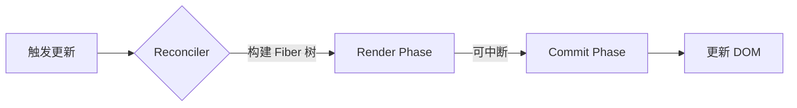
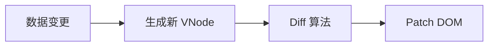

在 **前端框架（React & Vue）** 中，`FiberNode` 和 `VNode` 都是用于描述 **UI 结构** 的虚拟节点，但它们的实现目标、数据结构和运行机制有显著差异。

## **1. 基本概念**

|              | **FiberNode（React）**                       | **VNode（Vue）**             |
| ------------ | -------------------------------------------- | ---------------------------- |
| **全称**     | Fiber Node（纤程节点）                       | Virtual Node（虚拟节点）     |
| **所属框架** | React 16+（Reconciliation 引擎）             | Vue 2/3（Virtual DOM 核心）  |
| **核心作用** | **增量渲染 + 可中断更新**                    | **高效 Diff + 渲染优化**     |
| **设计目标** | 支持 Concurrent Mode（时间切片、任务优先级） | 提供响应式 UI 更新的最小开销 |

---

## **2. 数据结构对比**

### **(1) FiberNode（React）**

Fiber 是 **链表结构**，包含更复杂的调度信息：

```ts
interface FiberNode {
  tag: WorkTag; // 组件类型（Function/Class/Host）
  key: string | null;
  type: string | Function; // DOM 标签或组件函数
  stateNode: any; // 对应的真实 DOM 或组件实例

  // 链表指针
  return: FiberNode | null; // 父节点
  child: FiberNode | null; // 第一个子节点
  sibling: FiberNode | null; // 兄弟节点

  // 更新相关
  pendingProps: Props; // 新 Props
  memoizedProps: Props; // 当前 Props
  memoizedState: any; // 当前 State（Hooks 存储位置）
  alternate: FiberNode | null; // 指向另一棵树的对应节点（双缓存）

  // 调度优先级
  lanes: Lanes; // 任务优先级（Concurrent Mode）
  flags: Flags; // 副作用标记（Placement/Update/Deletion）
}
```

**特点**：

- **双向链表**（便于中断和恢复）。
- **保存组件状态**（Hooks 依赖 `memoizedState`）。
- **优先级调度**（`lanes` 和 `flags` 支持时间切片）。

---

### **(2) VNode（Vue）**

VNode 是 **树形结构**，更轻量，专注于 Diff：

```ts
interface VNode {
  tag: string | Component; // HTML 标签或 Vue 组件
  data: VNodeData | null; // Props/Attrs/Directives
  children: VNode[] | string; // 子节点

  elm: Node | null; // 对应的真实 DOM
  key: string | number; // Diff 优化关键标识

  // Vue 3 新增
  patchFlag: number; // 动态节点标记（优化 Diff）
  dynamicProps: string[]; // 动态 Props 列表
}
```

**特点**：

- **树状结构**（递归 Diff）。
- **静态标记优化**（Vue 3 的 `patchFlag` 跳过静态节点）。
- **无调度逻辑**（Vue 的更新是同步的）。

---

## **3. 核心差异**

| **维度**       | **FiberNode（React）**            | **VNode（Vue）**                  |
| -------------- | --------------------------------- | --------------------------------- |
| **数据结构**   | 双向链表（可中断遍历）            | 树形结构（递归 Diff）             |
| **更新机制**   | 增量渲染（分片执行）              | 批量异步更新（nextTick）          |
| **优先级调度** | ✅（Concurrent Mode）             | ❌（Vue 无时间切片）              |
| **状态管理**   | 状态保存在 Fiber 中（Hooks 依赖） | 状态由组件实例管理                |
| **Diff 优化**  | 基于链表遍历 + 副作用标记         | 静态标记（patchFlag） + 双向 Diff |
| **适用场景**   | 复杂交互应用（需要高优先级更新）  | 快速响应的数据驱动 UI             |

---

## **4. 工作流程对比**

### **(1) React Fiber 工作流程**

1. **Render 阶段**：
   - 构建 Fiber 树（协调 Reconciler），标记副作用（如 `Placement`）。
   - **可中断**（时间切片）。
2. **Commit 阶段**：
   - 同步执行 DOM 更新（不可中断）。



### **(2) Vue VNode 工作流程**

1. **生成 VNode**：
   - 模板编译或 `render()` 生成新 VNode 树。
2. **Diff + Patch**：
   - 对比新旧 VNode，直接更新 DOM（无中断机制）。



---

## **5. 性能优化方向**

### **React Fiber**

- **减少 Render 阶段计算**：`React.memo`、`useMemo`。
- **优先级控制**：`useTransition` 标记低优先级更新。

### **Vue VNode**

- **静态提升**：Vue 3 的 `hoistStatic` 跳过静态节点。
- **Block Tree**：动态节点靶向更新（`patchFlag`）。

---

## **6. 总结**

- **FiberNode** 是 React 为实现 **并发渲染** 设计的调度单元，适合复杂交互场景。
- **VNode** 是 Vue 的 **虚拟 DOM 核心**，专注高效 Diff，适合数据驱动型应用。
- **选择建议**：
  - 需要时间切片/任务优先级 → **React Fiber**。
  - 追求更快的渲染速度 → **Vue VNode**。

**补充**：React 的 Fiber 架构是 VNode 的进化版，解决了栈调和（Stack Reconciler）无法中断的问题。
