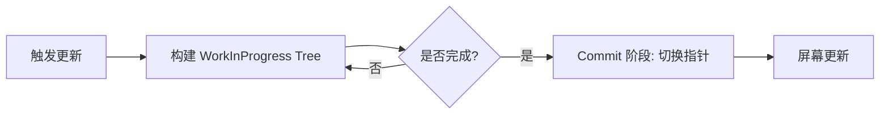

React 的 **双缓存（Double Buffering）机制** 是 Fiber 架构的优化策略之一，主要在 **Commit 阶段** 发挥作用，用于 **无缝切换新旧 Fiber 树**，确保渲染的连续性和性能。

## **1. 什么是双缓存？**

双缓存是计算机图形学中的经典技术，通过维护 **两套数据结构**（当前显示的和正在计算的）避免中间状态闪烁。React 借鉴这一思想，在内存中维护两棵 Fiber 树：
- **Current Tree（当前树）**：对应屏幕上正在显示的 UI。
- **WorkInProgress Tree（工作树）**：正在后台构建的新 UI。

**切换时机**：当 WorkInProgress 树构建完成后，Commit 阶段会直接交换两树的指针，实现无闪烁更新。

## **2. 双缓存在 React 中的实现**

### **(1) Fiber 节点的 `alternate` 指针**

每个 Fiber 节点都有一个 `alternate` 属性，指向另一棵树中的对应节点：

```js
interface FiberNode {
  // 当前树的节点
  stateNode: HTMLElement; // 对应的真实 DOM
  // 指向另一棵树的节点
  alternate: FiberNode | null;
  // 其他属性…
}
```

- **初始化时**：两棵树通过 `alternate` 互相引用。
- **更新时**：复用或新建 Fiber 节点，保持双树结构。

### **(2) 两棵树的协作流程**



1. **Render 阶段**：
   - 从 `current.alternate` 克隆或新建节点，构建 `WorkInProgress` 树。
   - 所有更新（如状态变更、Diff）只在 `WorkInProgress` 树上进行。

2. **Commit 阶段**：
   - **原子性切换**：将 `WorkInProgress` 树设置为新的 `Current` 树（指针交换）。
   - **DOM 更新**：根据新树更新真实 DOM（此时用户看到新 UI）。

---

## **3. 双缓存的核心优势**

### **(1) 无中间状态闪烁**

- 用户永远不会看到“半成品”UI（如部分旧 DOM + 部分新 DOM）。
- 因为 **DOM 更新是原子操作**（整树切换）。

### **(2) 性能优化**

- **复用 Fiber 节点**：通过 `alternate` 复用未变化的节点，减少内存分配。
- **并行构建**：浏览器空闲时可提前构建下一帧的 `WorkInProgress` 树。

### **(3) 支持异步渲染**

- 允许高优先级任务打断当前渲染，保留 `WorkInProgress` 树的中间状态，后续继续构建。

---

## **4. 实际代码示例**

### **(1) 双树切换的关键代码**

```js
// ReactFiberWorkLoop.js (简化版)
function commitRoot(root) {
  const finishedWork = root.finishedWork;
  // 1. 切换当前树指针
  root.current = finishedWork;
  // 2. 提交 DOM 更新
  commitMutationEffects(finishedWork);
}
```

### **(2) Fiber 节点的复用逻辑**

```js
// ReactFiber.js (简化版)
function createWorkInProgress(current, pendingProps) {
  let workInProgress = current.alternate;
  if (!workInProgress) {
    // 没有 alternate 则新建节点
    workInProgress = new FiberNode(…);
    current.alternate = workInProgress;
    workInProgress.alternate = current;
  }
  // 复用属性
  workInProgress.pendingProps = pendingProps;
  return workInProgress;
}
```

---

## **5. 与 Vue 的 Virtual DOM 对比**

| **特性**               | **React (双缓存 Fiber)**                  | **Vue (Virtual DOM)**               |
|------------------------|------------------------------------------|-------------------------------------|
| **更新策略**           | 增量构建 + 原子切换                      | 全量 Diff + 批量 Patch              |
| **中间状态**           | 无（双树隔离）                          | 可能存在临时中间状态                |
| **内存占用**           | 较高（维护两棵树）                      | 较低（单树 + 动态 Diff）            |
| **适用场景**           | 复杂交互、高优先级任务                  | 数据驱动的高效更新                  |

## **6. 总结**

- **双缓存本质**：
	- 通过 `current` 和 `workInProgress` 两棵 Fiber 树的交替更新，实现无卡顿渲染。
- **核心操作**：
  1. **Render 阶段**：在内存中构建新树（不阻塞 UI）。
  2. **Commit 阶段**：原子切换树指针 + 同步更新 DOM。
- **优势**：
  - 避免 UI 闪烁。
  - 支持时间切片和任务中断。
  - 高效复用节点，减少 GC 压力。

**这就是为什么 React 能实现流畅的并发渲染！**
