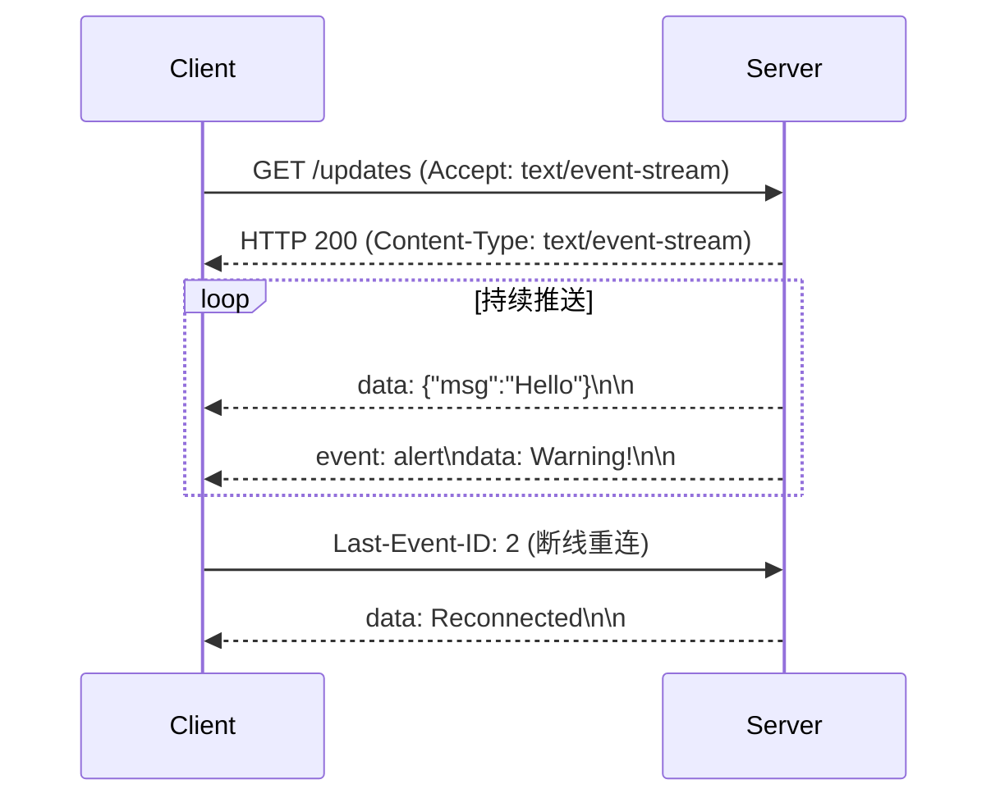

### SSE 是什么

Server-Sent Events (SSE) 是一种完全基于 HTTP 的轻量级协议，允许服务端向客户端单向推送数据。
它简单高效，适合无需双向通信的场景，且能复用 HTTP 基础设施。

### 工作原理

#### **1. 建立连接**

**客户端**通过普通 HTTP 请求发起连接，需指定 `Accept: text/event-stream` 头：

```http
GET /updates HTTP/1.1
Accept: text/event-stream
Cache-Control: no-cache
Connection: keep-alive
```

**服务端**响应需包含 `Content-Type: text/event-stream` 头：

```http
HTTP/1.1 200 OK
Content-Type: text/event-stream
Connection: keep-alive
Cache-Control: no-cache
Transfer-Encoding: chunked

data: {"price": 100}\n\n
```

**关键点**：

- 连接必须使用 **HTTP/1.1 或 HTTP/2**（不支持 HTTP/1.0）。
- 使用的仍然是纯 HTTP，浏览器会限制每个源的 SSE 连接数（通常 6 个），需注意复用连接。

---

#### **2. 消息结构**

服务端推送的消息格式为一段纯文本

- 必须是 utf-8 编码
- 每条消息由以下字段组成（字段均可选）：

```event-stream
event: price_update\n
id: 12345\n
retry: 10000\n
data: {"symbol":"BTC","price":"50000"}\n\n
```

| 字段     | 作用                                                               | 示例                                              |
| -------- | ------------------------------------------------------------------ | ------------------------------------------------- |
| `data:`  | 消息内容（必选）。多行数据需每行前缀 `data:`，最终合并为单行。     | `data: Hello\nWorld` → `Hello\nWorld`             |
| `event:` | 自定义事件类型（默认 `message`）。客户端可监听特定事件。           | `eventSource.addEventListener("price_update", …)` |
| `id:`    | 消息 ID。客户端断开重连时，通过 `Last-Event-ID` 头告知服务端断点。 | `Last-Event-ID: 12345`                            |
| `retry:` | 重连时间（毫秒）。客户端断开后按此间隔重试。                       | `retry: 5000`（5 秒重试）                         |

- 每条消息以 **两个换行符（`\n\n`）** 结尾
- 注释行以 `:` 开头（服务端可发送心跳包）：

  ```event-stream
  : This is a comment\n\n
  ```

---

#### **3. 连接保活机制**

**（1）自动重连**

- 客户端断开后自动按 `retry:` 时间重试（默认 3 秒）。
- 重连时通过 `Last-Event-ID` 头恢复断点：

```http
GET /updates HTTP/1.1
Last-Event-ID: 12345
```

**（2）心跳包**
服务端定期发送注释或空消息保持连接活跃：

```event-stream
: heartbeat\n\n
```

**（3）超时控制**

- 浏览器默认无超时限制，但部分代理服务器可能关闭空闲连接（通常 30 秒）。
- 可通过 `retry:` 调整重连策略。

---

#### **4. 关闭连接**

**服务端主动关闭**：

- 直接终止 HTTP 连接（无特殊协议）。
- 客户端会触发 `error` 事件并自动重连。

**客户端主动关闭**：

```javascript
const eventSource = new EventSource("/updates");
eventSource.close(); // 关闭连接
```

**关闭后的行为**：

- 客户端停止自动重连。
- 需重新创建 `EventSource` 实例才能再次连接。

---

### **完整流程示例**



### 前端 API

```javascript
const eventSource = new EventSource("/api/sse");
eventSource.onmessage = (event) => {
  console.log("推送数据:", event.data);
};
eventSource.onerror = (error) => {
  console.log(error);
};

// eventSource.close()
```

### **注意事项**

1. **跨域问题**：
   - 需服务端设置 `Access-Control-Allow-Origin`。
   - 不支持携带 Cookie（除非设置 `withCredentials: true`）。

2. **性能优化**：
   - 合并多条消息减少 HTTP 帧数量。
   - 避免频繁发送小数据（启用 HTTP/2 多路复用）。

3. **浏览器兼容性**：
   - 不支持 IE/Edge Legacy，其他主流浏览器均支持。
   - 可通过 polyfill（如 `eventsource` 库）兼容旧浏览器。

---

### 拓展阅读

[HTTP/2 + SSE 能否完全替代 Websocket吗？](https://mp.weixin.qq.com/s/iGIvuZC8w3kBou4dZi-gvA) #todo
