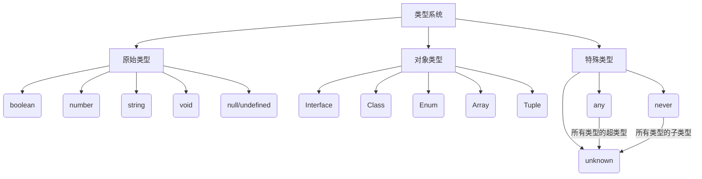

以下是 TypeScript 核心类型的简明介绍，按类别分类说明：

### 原始类型 (Primitive Types)

1. **`boolean`**
   - 逻辑值：`true` 或 `false`

   ```ts
   let isActive: boolean = true;
   ```

2. **`number`**
   - 所有数值类型（整数、浮点数、二进制等）

   ```ts
   let count: number = 42;
   let hex: number = 0xf00d; // 十六进制
   ```

3. **`string`**
   - 文本数据（支持模板字符串）

   ```ts
   let name: string = "Alice";
   let greeting = `Hello ${name}`;
   ```

4. **`void`**
   - 表示 " 没有返回值 "，常用于函数返回类型

   ```ts
   function log(): void {
     console.log("Done");
   }
   ```

5. **`undefined`**
   - 变量未定义时的默认值

   ```ts
   let data: undefined;
   ```

6. **`null`**
   - 表示空值（需显式设置）

   ```ts
   let empty: null = null;
   ```

> **注意**：开启 `strictNullChecks` 时，`null/undefined` 只能赋值给 `any` 和各自类型

---

### 对象类型 (Object Types)

1. **`Interface`**
   - 定义对象结构的契约

   ```ts
   interface User {
     id: number;
     name: string;
   }
   ```

2. **`Class`**
   - 面向对象的实现（属性、方法、继承）

   ```ts
   class Person {
     constructor(public name: string) {}
   }
   ```

3. **`Enum`**
   - 命名常量集合

   ```ts
   enum Direction {
     Up = "UP",
     Down = "DOWN",
   }
   ```

4. **`Array`**
   - 相同类型元素的集合；可变长

   ```ts
   let numbers: number[] = [1, 2, 3];
   let users: Array<User> = [];
   ```

5. **`Tuple`**
   - 元素可以是不同类型、固定长度的数组

   ```ts
   let result: [string, number] = ["OK", 200];
   ```

6. **`Object`**
   - 非原始值的通用类型（较少直接使用）

   ```ts
   let obj: object = { key: "value" };
   ```

---

### 顶级类型 (Top Types)

1. **`unknown`**
   - 类型安全的 " 任意类型 "（使用前需类型检查）

   ```ts
   let input: unknown;
   if (typeof input === "string") {
     input.toUpperCase(); // 安全操作
   }
   ```

2. **`any`**
   - 关闭类型检查的逃生舱（尽量避免）

   ```ts
   let anything: any = "danger!";
   anything.toFixed(); // 编译通过，运行时错误
   ```

---

### 底部类型 (Bottom Type)

1. **`never`**
   - 表示永远不发生的值

   ```ts
   function error(message: string): never {
     throw new Error(message);
   }

   // 类型收窄示例
   type All = string | number;
   function check(value: All) {
     if (typeof value === "string") {
       // 处理 string
     } else if (typeof value === "number") {
       // 处理 number
     } else {
       value; // 类型为 never
     }
   }
   ```

---

### 类型关系图



### 关键区别

| 类型               | 特点                        | 使用场景               |
| ------------------ | --------------------------- | ---------------------- |
| **any**            | 完全禁用类型检查            | 迁移 JS 项目或应急方案 |
| **unknown**        | 需类型断言/收窄后才允许操作 | 安全处理第三方数据     |
| **never**          | 表示不可能存在的状态        | 穷尽检查、错误处理     |
| **void**           | 无返回值                    | 函数返回类型           |
| **null/undefined** | 需显式处理                  | 可选值表示             |

> **最佳实践**：
>
> - 优先使用 `unknown` 替代 `any`
> - 用 `never` 实现穷尽检查
> - 开启 `strictNullChecks` 避免空值错误
> - 对象结构优先使用 `interface` 而非 `object`
