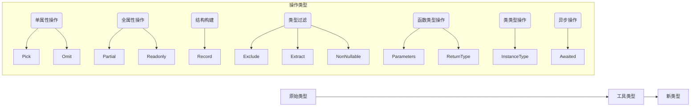

以下是 TypeScript 中的工具类型的详细解析，这些类型都是基于 TypeScript 的类型系统构建的**类型操作工具**，用于创建新类型或转换现有类型：

Partial,Require, Pick, Omit, Readonly, Record, Exclude, Extract, Awaited, Parameters, NonNullable, ReturnType, InstanceType

### 1. `Partial<T>` 可选

将类型 `T` 的所有属性变为可选属性

```typescript
interface User {
  id: number;
  name: string;
}

type PartialUser = Partial<User>;
// 等价于 { id?: number; name?: string; }
```

**使用场景**：API 更新操作中允许部分字段更新

类似的， `Require<T>` 将所有属性设为必选

### 2. `Pick<T, K>` 挑选属性

从类型 `T` 中选取指定属性 `K` 组成新类型

```typescript
type UserName = Pick<User, "name">; // { name: string }
```

**使用场景**：创建视图模型，仅包含需要的字段

---

### 3. `Omit<T, K>` 排除属性

从类型 `T` 中排除指定属性 `K` （和 Pick 相反）

```typescript
type UserWithoutId = Omit<User, "id">; // { name: string }
```

**使用场景**：隐藏敏感字段（如密码）

---

### 4. `Readonly<T>` 只读

使类型 `T` 的所有属性变为只读

```typescript
type ReadonlyUser = Readonly<User>;
// { readonly id: number; readonly name: string; }
```

**使用场景**：配置对象或常量定义

---

### 5. `Record<K, T>` 映射

创建键为 `K`，值为 `T` 的对象类型

```typescript
type PageMap = Record<"home" | "about", string>;
// { home: string; about: string; }

interface CatInfo {
  age: number;
  breed: string;
}
type CatName = "miffy" | "boris" | "mordred";

const cats: Record<CatName, CatInfo> = {
  miffy: { age: 10, breed: "Persian" },
  boris: { age: 5, breed: "Maine Coon" },
  mordred: { age: 16, breed: "British Shorthair" },
};
```

**使用场景**：枚举映射、配置字典

---

### 6. `Exclude<T, U>` 排除类型

从类型 `T` 中排除可赋值给 `U` 的类型

```typescript
type T0 = Exclude<"a" | "b" | "c", "a">; // 'b' | 'c'
type T1 = Exclude<string | number | (() => void), Function>; // string | number
```

**使用场景**：过滤联合类型

---

### 7. `Extract<T, U>` 提取类型

从类型 `T` 中提取可赋值给 `U` 的类型

```typescript
type T0 = Extract<"a" | "b" | "c", "a" | "f">; // 'a'
type T1 = Extract<string | number | (() => void), Function>; // () => void
```

**使用场景**：筛选特定类型

---

### 8. `Awaited<T>` Promise

获取 Promise 的解析值类型（支持嵌套 Promise）

```typescript
type P1 = Awaited<Promise<string>>; // string
type P2 = Awaited<Promise<Promise<number>>>; // number
```

**使用场景**：异步函数返回值类型提取

---

### 9. `Parameters<T>` 函数参数

获取函数类型 `T` 的参数元组类型

```typescript
declare function f1(arg: { a: number; b: string }): void;

type Params = Parameters<typeof f1>;
// [arg: { a: number; b: string }]
```

**使用场景**：高阶函数参数转发

---

### 10. `NonNullable<T>` 排除空类型

排除类型 `T` 中的 `null` 和 `undefined`

```typescript
type T0 = NonNullable<string | null | undefined>; // string
```

**使用场景**：数据清洗后类型保障

---

### 11. `ReturnType<T>` 获取返回值类型

获取函数类型 `T` 的返回值类型

```typescript
type Fn = () => User;
type Result = ReturnType<Fn>; // User
```

**使用场景**：React 组件 props 类型提取

---

### 12. `InstanceType<T>` 获取实例类型

获取构造函数类型 `T` 的实例类型

```typescript
class C {
  x = 0;
  y = 0;
}

type T0 = InstanceType<typeof C>; // C
type T1 = InstanceType<new () => C>; // C
```

**使用场景**：工厂模式类型安全

---

### 类型操作可视化s



### 实用技巧

1. **组合使用**：

   ```typescript
   // 创建只读的部分属性类型
   type ReadonlyPartial<T> = Readonly<Partial<T>>;
   ```

2. **类型安全路由参数**：

   ```typescript
   const routes = {
     "/user": (id: string) => `User ${id}`,
     "/post": (slug: string) => `Post ${slug}`,
   };

   type RouteParams = {
     [K in keyof typeof routes]: Parameters<(typeof routes)[K]>;
   };
   ```

3. **API 响应包装**：

   ```typescript
   type APIResponse<T> = {
     data: Awaited<T>;
     timestamp: Date;
   };
   ```

> **最佳实践**：在大型项目中，将这些工具类型与 `interface` 结合使用，可显著提升代码可维护性和类型安全性。
