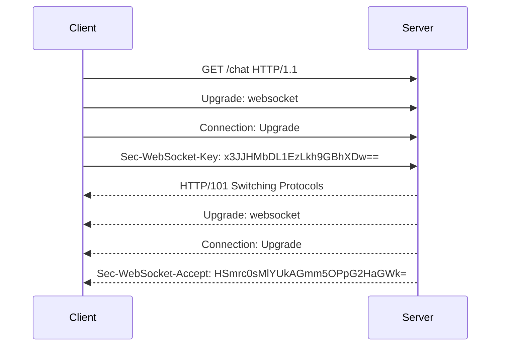

### WebSocket 是什么

**WebSocket** 是一个独立的、面向长连接、低延迟的全双工双向通信协议，适合实时应用。
- 建立在 TCP 之上，仅借用 HTTP 完成握手，就可以把 HTTP 协议升级成 WebSocket
- 使用二进制帧协议实现高效数据传输

### **WebSocket 底层原理**

#### **1. 建立连接：HTTP 升级握手**

WebSocket 通过 HTTP 协议升级实现连接建立，具体流程如下：



- **关键字段**：
  - `Upgrade: websocket`：声明协议升级。
  - `Sec-WebSocket-Key`：客户端随机生成的 Base64 密钥。
  - `Sec-WebSocket-Accept`：服务端用固定算法生成的响应密钥。
    
- 客户端拿到服务端响应的 Sec-WebSocket-Accept 后，会拿自己之前生成的 Sec-WebSocket-Key 用相同算法算一次，如果匹配，则握手成功。
- 然后判断 HTTP Response 状态码是否为 101（切换协议），如果是，则完成连接，建立了一个全双工通信，后续发送和接收消息都会走这一个连接通道。
  
![[Pasted image 20250615022126.png]]

#### **2. 二进制帧**

WebSocket 数据传输以帧（Frame）为单位，数据帧格式（Frame Protocol）如下：

```
0                   1                   2                   3
0 1 2 3 4 5 6 7 8 9 0 1 2 3 4 5 6 7 8 9 0 1 2 3 4 5 6 7 8 9 0 1
+-+-+-+-+-------+-+-------------+-------------------------------+
|F|R|R|R| opcode|M| Payload len |    Extended payload length    |
|I|S|S|S|  (4)  |A|     (7)     |             (16/64)           |
|N|V|V|V|       |S|             |   (if payload len==126/127)   |
| |1|2|3|       |K|             |                               |
+-+-+-+-+-------+-+-------------+ - - - - - - - - - - - - - - - +
|     Extended payload length continued, if payload len == 127  |
+ - - - - - - - - - - - - - - - +-------------------------------+
|                               |Masking-key, if MASK set to 1  |
+-------------------------------+-------------------------------+
| Masking-key (continued)       |          Payload Data         |
+-------------------------------- - - - - - - - - - - - - - - - +
:                     Payload Data continued …                :
+ - - - - - - - - - - - - - - - - - - - - - - - - - - - - - - - +
|                     Payload Data continued …                |
+---------------------------------------------------------------+
```

- **关键字段**：
  - **opcode**：帧类型（如 `0x1` 文本帧，`0x2` 二进制帧）。
  - **Mask**：客户端发送的数据必须掩码（服务端发送无需掩码）。
  - **Payload length**：数据长度（支持分片传输）。

#### **3. 保持连接活跃**

- **Ping/Pong 帧**：
  服务端定期发送 `Ping` 帧（opcode `0x9`），客户端回复 `Pong` 帧（opcode `0xA`）以检测连接存活。
- **超时关闭**：若未收到响应，主动断开连接。

#### **4. 关闭连接**

通过发送 `Close` 帧（opcode `0x8`）优雅终止连接，包含关闭状态码（如 `1000` 表示正常关闭）。

---

### **WebSocket 与 HTTP 的区别**

[[对比：WebSocket 协议 vs. HTTP 协议]]

### **WebSocket 的应用场景**

1. **实时性要求高的场景**
   - 在线游戏（如 MOBA 游戏的技能同步）
   - 金融实时行情（股票价格推送）
2. **高频双向交互**
   - 聊天应用（微信、Slack）
   - 协同编辑（Google Docs）
3. **物联网（IoT）**
   - 设备状态实时监控

---

### 前端 WebSocketAPI

- 原生 WebSocket API

```js
// Create WebSocket connection. 
const socket = new WebSocket('ws://localhost:8080');

// Connection opened 
socket.addEventListener('open', function (event) { 
	socket.send('Hello Server!'); 
}); 

// Listen for messages 
socket.addEventListener('message', function (event) { 
	console.log('Message from server ', event.data); 
});
```

- 可以使用 `Socket.io / ws` 库

```html
<!--前端页面 -->
<div>user input：<input type="text" /></div>
<script src="https://cdn.bootcss.com/socket.io/2.2.0/socket.io.js"></script>

<script>
  var socket = io("http://www.domain2.com:8080");

  // 连接成功处理
  socket.on("connect", function () {
    // 监听服务端消息
    socket.on("message", function (msg) {
      console.log("data from server: ---> " + msg);
    });

    // 监听服务端关闭
    socket.on("disconnect", function () {
      console.log("Server socket has closed.");
    });
  });

  document.getElementsByTagName("input")[0].onblur = function () {
    socket.send(this.value);
  };
</script>
```

```js
// server
var http = require("http");
var socket = require("socket.io");

// 启http服务
var server = http.createServer(function (req, res) {
  res.writeHead(200, {
    "Content-type": "text/html",
  });
  res.end();
});

server.listen("8080");
console.log("Server is running at port 8080...");

// 监听socket连接
socket.listen(server).on("connection", function (client) {
  // 接收信息
  client.on("message", function (msg) {
    client.send("hello：" + msg);
    console.log("data from client: ---> " + msg);
  });

  // 断开处理
  client.on("disconnect", function () {
    console.log("Client socket has closed.");
  });
});
```
