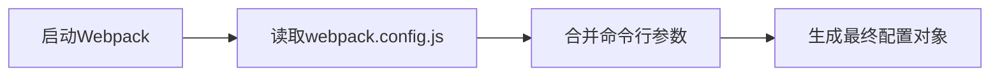
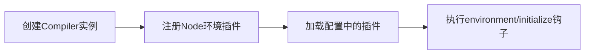
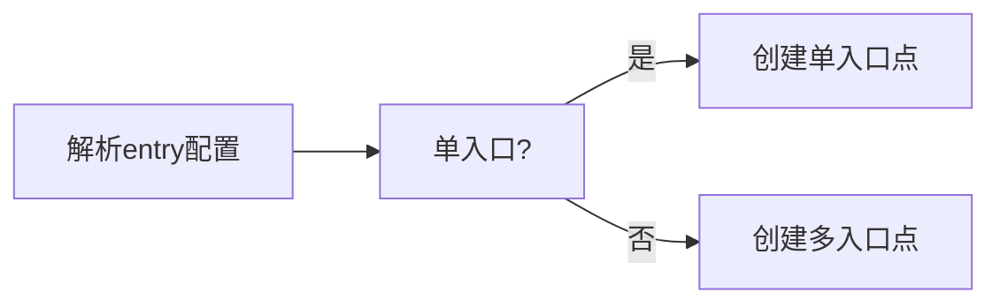
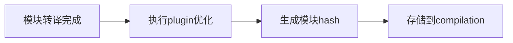
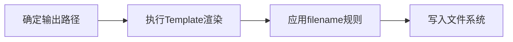

> Q: 简述一下 webpack 打包的流程

1. 初始化参数,配置解析 : 读取配置文件（webpack.config.js 或命令行参数）
2. 开始编译: 启动 webpack，实例化 Compiler 对象，加载所有配置，并注册内置插件和配置文件中注册的插件,开始执行编译
3. 确定入口: 根据 entry 中的配置，找出所有的入口
4. 编译模块: 从入口文件开始，webpack 解析模块路径，递归找出与入口直接或间接依赖的模块
5. 完成模块编译: loader 转换和 plugin 处理，得到每个模块被编译后的最终内容，并构建各模块之间的依赖关系图 (dependency graph)
6. 模块封装,输出资源：根据依赖关系图，组装成包含多个依赖 module 的 chunk
7. 输出完成：根据 output 配置，确定要输出的 filename 和 path，输出 bundle

### 1. 📝 **初始化阶段** - 参数解析与配置准备



- 读取 `webpack.config.js` 或命令行参数
- 合并默认配置、用户配置和命令行参数
- 验证配置有效性，处理配置默认值

### 2. 🚀 **编译启动** - Compiler 实例化



- 创建唯一的 `Compiler` 实例（Webpack 的中枢神经系统）
- 自动注册内置插件（如 `NodeEnvironmentPlugin`）
- 调用所有插件的 `apply` 方法
- 触发 `environment` 和 `afterEnvironment` 生命周期钩子

### 3. 🎯 **入口分析** - 依赖图谱起点



- 解析 `entry` 配置（支持字符串/数组/对象形式）
- 创建对应的 `EntryDependency` 对象
- 触发 `entryOption` 钩子（插件可在此修改入口）

### 4. 🔍 **模块编译** - 构建依赖图谱


- **关键过程**：
  - 使用 `enhanced-resolve` 解析模块路径
  - 调用匹配的 `loader` 进行转译（如 babel-loader）
  - 通过 AST 分析找出 `require`/`import` 语句
  - 递归处理所有依赖模块
  - 生成模块的唯一标识（`module identifier`）

### 5. ✅ **模块完成** - 最终处理阶段



- 执行 `loader` 后的最终代码处理
- 触发 `seal` 阶段前的各种优化钩子
- 生成模块内容 hash（用于缓存）
- 构建完整的模块依赖关系图（Dependency Graph）

### 6. 🧩 **代码分块** - Chunk 生成


- **分块策略**：
  - 每个入口生成独立 chunk
  - 动态导入自动创建新 chunk
  - 根据 `SplitChunksPlugin` 配置优化拆分
  - 触发 `optimizeChunks` 等优化钩子

### 7. 📦 **资源输出** - 文件生成



- **输出阶段**：
  - 根据 `output.filename` 模板生成最终文件名
  - 调用 `Template` 生成 runtime 代码
  - 触发 `emit` 钩子（插件可修改最终资源）
  - 使用 `fs` 模块写入到目标目录
  - 触发 `done` 钩子（构建完成通知）

## 🛠 常见优化点

1. **利用缓存**：
   - `cache: true` 开启构建缓存
   - `loader` 自身缓存（如 babel-loader?cacheDirectory）

2. **并行处理**：

   ```javascript
   module.exports = {
     // 使用多进程并行处理
     parallel: true,
     // 或者更精细的配置
     optimization: {
       minimize: true,
       minimizer: [new TerserPlugin({ parallel: true })],
     },
   };
   ```

3. **Tree Shaking**：
   - 确保使用 ES Module 语法
   - 设置 `mode: 'production'`
   - 避免有副作用的模块
