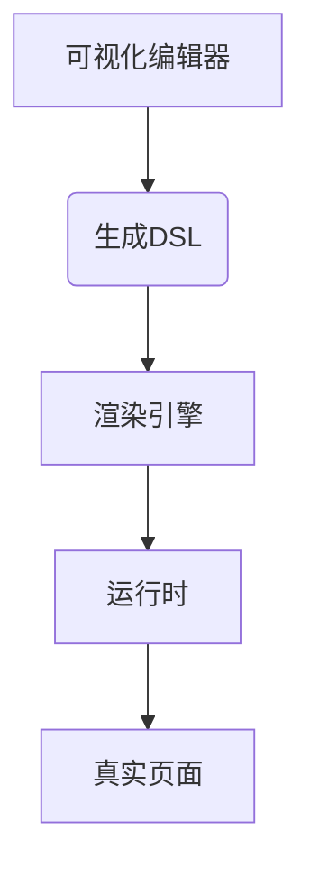

前端工程化是现代 Web 开发的核心，它通过标准化、自动化和工具化的方式提升开发效率和质量。以下是全面的前端工程化实践方案：

## 一、代码管理

### 1. 版本控制规范

- **Git 工作流**：采用 Git Flow 或 Trunk Based Development
- **提交规范**：使用 Commitizen + commitlint

```bash
# 安装Commitizen
npm install -g commitizen
cz-conventional-changelog
```

### 2. Monorepo 管理

- **工具选型**：
  - Lerna（传统方案）
  - pnpm workspace（推荐）
  - Turborepo（高性能构建）
- **目录结构**：

```
monorepo/
├── apps/
│   ├── web-app/
│   └── mobile-app/
├── packages/
│   ├── ui-components/
│   └── utils/
└── turbo.json
```

## 二、开发工具链

### 1. 脚手架体系

- **自定义 CLI**：

```javascript
// scripts/create.js
const { prompt } = require('enquirer');
const fs = require('fs-extra');

async function createProject() {
  const { projectName } = await prompt({
    type: 'input',
    name: 'projectName',
    message: 'Project name:'
  });
  
  fs.copySync(templateDir, projectDir);
  console.log('Project created!');
}
```

### 2. 开发服务器

- **现代方案**：
  - Vite（推荐）
  - Webpack
- **功能增强**：
  - API Mock（使用 vite-plugin-mock）
  - HTTPS 支持
  - 代理配置

## 三、构建优化

### 1. 打包策略

| **优化方向**       | **实施方案**                              | 工具/插件                          |
|--------------------|------------------------------------------|-----------------------------------|
| 代码分割          | 动态 import() + 路由懒加载                | Webpack SplitChunks               |
| Tree Shaking       | 生产模式自动启用 + sideEffects 配置       | Rollup/Webpack                   |
| 持久缓存          | 内容哈希命名                             | `[name].[contenthash].js`         |
| 压缩优化          | ESBuild 压缩 + 图片优化                   | vite-plugin-compression           |

### 2. 性能分析

- webpack-bundle-analyser
- rollup-plugin-visualizer

```javascript
// vite.config.js
import { visualizer } from 'rollup-plugin-visualizer';

export default {
  plugins: [
    visualizer({ open: true })
  ]
}
```

## 四、质量保障

### 1. 代码规范

- **ESLint 配置**：

```json
{
  "extends": ["airbnb", "prettier"],
  "rules": {
    "react-hooks/exhaustive-deps": "error"
  }
}
```

- **Husky + lint-staged**：

```json
{
  "husky": {
    "hooks": {
      "pre-commit": "lint-staged"
    }
  },
  "lint-staged": {
    "*.{js,jsx}": ["eslint --fix", "prettier --write"]
  }
}
```

### 2. 测试体系

| **测试类型** | **工具链**                         | **覆盖场景**  |
| -------- | ------------------------------- | --------- |
| 单元测试     | Vitest / Jest + Testing Library | 工具函数/组件渲染 |
| E2E 测试   | Playwright / Cypress            | 用户流程验证    |
| 可视化测试    | Storybook + Chromatic           | UI 组件回归测试 |

## 五、部署与监控

### 1. CI/CD 流程

```yaml
# .github/workflows/deploy.yml
name: Deploy
on: push

jobs:
  deploy:
    runs-on: ubuntu-latest
    steps:
      - uses: actions/checkout@v2
      - run: npm ci
      - run: npm run build
      - uses: actions/upload-artifact@v2
        with:
          name: dist
          path: dist
      - run: aws s3 sync ./dist s3://my-bucket
```

### 2. 性能监控

- **RUM（真实用户监控）**： [[RUM（真实用户监控）]]

```javascript
// 使用web-vitals库
import { getCLS, getFID, getLCP } from 'web-vitals';

function sendToAnalytics(metric) {
  const body = JSON.stringify(metric);
  navigator.sendBeacon('/analytics', body);
}

getCLS(sendToAnalytics);
getFID(sendToAnalytics);
getLCP(sendToAnalytics);
```

## 六、微前端架构

### 1. 实现方案对比

| **方案**        | **特点**                              | 适用场景                      |
|----------------|--------------------------------------|-----------------------------|
| 模块联邦       | Webpack 5 原生支持                    | 技术栈统一的项目群           |
| Qiankun        | 基于 single-spa                       | 多框架混合                   |
| iframe         | 隔离性最强                           | 第三方应用集成               |

### 2. 样式隔离方案

```javascript
// 使用Shadow DOM
class MicroApp extends HTMLElement {
  constructor() {
    super();
    this.attachShadow({ mode: 'open' });
    this.shadowRoot.innerHTML = `
      <style>/* 作用域CSS */</style>
      <div>子应用内容</div>
    `;
  }
}
```

## 七、低代码平台

### 1. 核心架构



### 2. 关键技术

- **拖拽库**：React DnD/SortableJS
- **渲染引擎**：

```jsx
function renderComponent(dsl) {
  const Comp = componentMap[dsl.type];
  return <Comp {…dsl.props} />;
}
```

## 八、前沿方向

### 1. 构建工具演进

- **ESM 优先**：Vite/Snowpack
- **Rust 工具链**：swc/rsbuild/rowndown

### 2. 性能优化

- **岛屿架构**（Islands Architecture）
- **部分水合**（Partial Hydration）

### 3. 开发体验

- **AI 辅助**：GitHub Copilot
- **零构建**：Import Maps

## 实施建议

1. **渐进式采用**：从 ESLint+Prettier 等基础规范开始
2. **度量驱动**：建立性能/质量基准指标
3. **文档沉淀**：维护工程化 Wiki 和决策记录 (ADR)
4. **工具链统一**：团队使用相同版本的工具

通过系统化的工程实践，团队可以实现：
- 开发效率提升 30%-50%
- 构建时间减少 40%-70%
- 生产环境错误率降低 60%+

前端工程化是持续演进的过程，建议每季度评估新技术并迭代方案。
