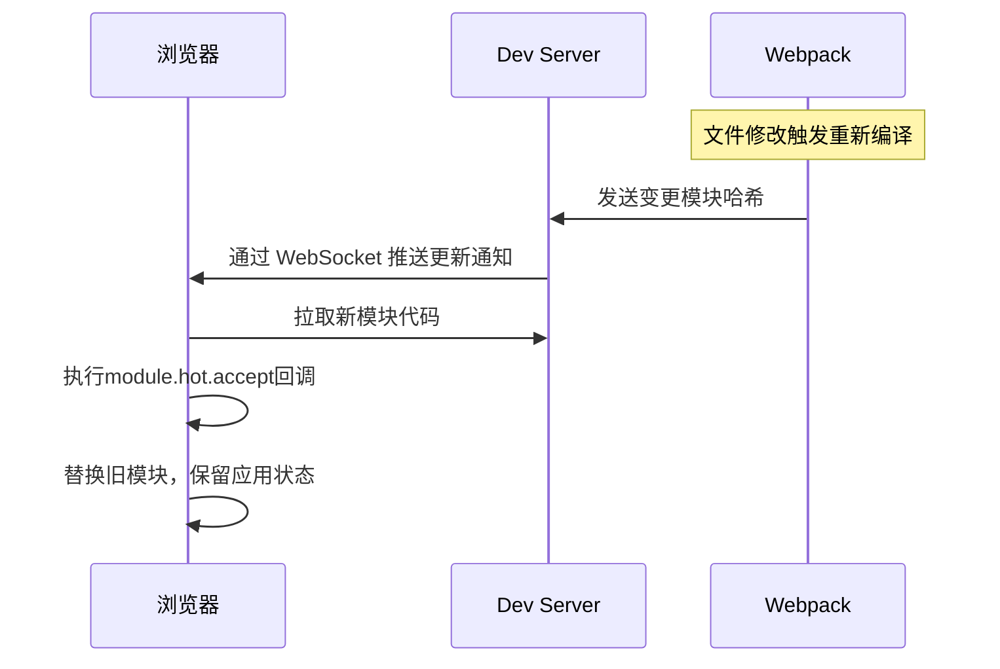

### **1. 核心概念**

模块级热更新是指在不刷新页面的情况下，动态替换应用中的**单个模块**（如组件、工具函数、路由配置），而非全应用重启。其技术本质是 **运行时模块替换** + **状态保持**。

### **2. 实现原理**

| **技术栈**       | **实现方案**                                                                 | **典型工具**                  |
|------------------|-----------------------------------------------------------------------------|-----------------------------|
| **Webpack**      | HMR（Hot Module Replacement）协议，通过 `module.hot.accept` 监听模块变更      | `webpack-dev-server`        |
| **Vite**         | 基于 ESM 的即时编译，通过 `import.meta.hot` 实现模块热替换                   | Vite 原生支持               |
| **微前端**       | 子应用独立打包，通过 `Module Federation` 动态加载更新模块                     | Webpack 5 / Vite            |
| **小程序**       | 差量更新 + 组件级热重载（Taro/Uniapp 的 `hot-reload` 机制）                  | Taro CLI / Uniapp 编译器    |

### **3. 关键技术实现**

#### **3.1 Webpack HMR 工作流**



#### **3.2 代码示例（React + Webpack）**

```javascript
// module.js
let count = 0;
export const increment = () => count++;

if (module.hot) {
  module.hot.accept('./module', () => {
    console.log('模块已热更新，当前count值保留:', count);
  });
}
```

### **4. 生产环境热更新方案**

| **场景**         | **技术方案**                                                                 | **代表工具**              |
|------------------|-----------------------------------------------------------------------------|-------------------------|
| **Web 应用**     | 动态 `import()` + Service Worker 缓存控制                                   | Workbox / Next.js       |
| **Electron**     | 主进程监听文件变化，渲染进程执行 `require('electron').ipcRenderer.invoke('reload-module')` | electron-hot-loader     |
| **React Native** | CodePush 或 Metro 的 `HMR` 功能                                             | Microsoft CodePush      |
| **微前端**       | 子应用独立部署，通过 `import()` 动态加载新版本                                | Qiankun / Module Federation |

### **5. 性能与安全优化**

- **增量更新**：仅传输变更模块（Webpack 的 `hot-update.json` + `.js` 文件）
- **沙箱隔离**：确保模块替换不影响全局状态（如 `Proxy` 代理模块导出）
- **版本回滚**：热更新失败时自动回退到稳定版本
- **签名校验**：对热更新包进行 HMAC 签名验证

### **6. 适用场景对比**

| **场景**               | **全量刷新** | **模块级热更新** | **优势**                          |
|------------------------|-------------|------------------|----------------------------------|
| **开发调试**           | ❌ 状态丢失  | ✅ 保留状态       | 快速验证交互逻辑                 |
| **生产环境 Bug 修复**  | 用户感知强   | 无感知           | 提升用户体验                    |
| **AB 测试**            | 需要部署新版本 | 动态替换模块     | 快速切换实验策略                |

### **7. 局限性**

- **状态兼容性**：新旧模块的数据结构需保持一致
- **CSS 热更新**：需额外配置 `style-loader` 或 `vue-style-loader`
- **复杂依赖**：循环引用的模块可能导致更新失效

### **8. 最佳实践**

1. **开发环境**：优先使用 Vite/Webpack 原生 HMR
2. **生产环境**：
   - Web 应用：Service Worker + 动态 `import()`
   - 小程序：Taro 的 `incremental` 差量更新
   - Electron：`electron-hot-loader` 监听文件变化
3. **微前端**：子应用独立热更新，主应用控制加载策略

通过模块级热更新，可实现 **秒级故障修复** 和 **无感知功能迭代**，将传统发布流程从小时级缩短至分钟级。
