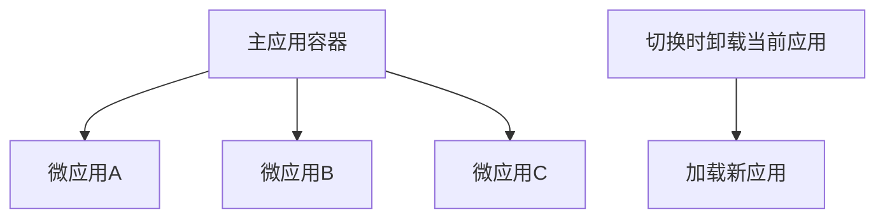
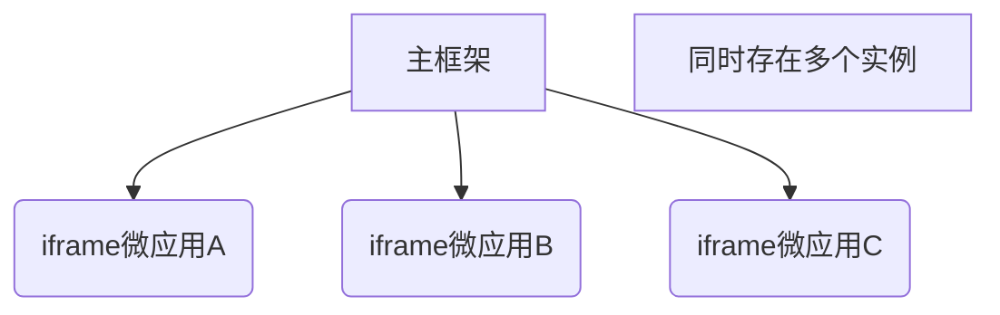

微前端 (Micro Frontends) 是一种将前端应用分解为多个独立模块的架构风格，类似于微服务在后端的应用。以下是微前端的核心原理和实现方式。

## 一、微前端核心原理

### 1. 基本原理

- **独立开发**：每个微应用可独立开发、测试和部署
- **独立运行**：微应用在运行时保持隔离性
- **技术栈无关**：不同微应用可使用不同技术栈 (React/Vue/Angular 等)
- **渐进式升级**：可逐步迁移旧系统

### 2. 关键技术实现方式

| 实现方式           | 原理                           | 优点           | 缺点             |
| ------------------ | ------------------------------ | -------------- | ---------------- |
| **路由分发**       | 通过 Nginx/反向路由分发请求    | 简单直接       | 全页面刷新       |
| **iframe**         | 使用 iframe 嵌入子应用         | 天然隔离       | 通信困难，性能差 |
| **Web Components** | 使用 Custom Element 封装微应用 | 浏览器原生支持 | 兼容性要求高     |
| **模块联邦**       | Webpack 5 的模块共享机制       | 高效资源共享   | 需 Webpack 5+    |
| **JS 沙箱**        | 主应用动态加载子应用 JS        | 灵活度高       | 实现复杂         |

## 二、主流实现方案

### 1. 单实例模式（SPA 风格）



### 2. 多实例模式（MPA 风格）



## 三、具体实现技术

### 1. 基于 Single-SPA 的实现

**架构图**：

```
主应用 (shell)
├── 导航路由
├── 应用加载器
└── 微应用
    ├── React应用 (app1)
    ├── Vue应用 (app2)
    └── Angular应用 (app3)
```

**实现步骤**：

1. 主应用配置：

```javascript
// 主应用入口
singleSpa.registerApplication(
  "app1",
  () => System.import("app1"),
  (location) => location.pathname.startsWith("/app1"),
);
```

1. 微应用配置（以 React 为例）：

```javascript
export function bootstrap() {
  /* 初始化 */
}
export function mount() {
  /* 渲染到DOM */
}
export function unmount() {
  /* 卸载应用 */
}
```

### 2. 基于模块联邦 (Webpack 5)

**配置示例**：

1. 主应用的 webpack 配置：

```javascript
new ModuleFederationPlugin({
  name: "host",
  remotes: {
    app1: "app1@http://localhost:3001/remoteEntry.js",
    app2: "app2@http://localhost:3002/remoteEntry.js",
  },
  shared: ["react", "react-dom"],
});
```

1. 微应用的 webpack 配置：

```javascript
new ModuleFederationPlugin({
  name: "app1",
  filename: "remoteEntry.js",
  exposes: {
    "./App": "./src/App",
  },
  shared: ["react", "react-dom"],
});
```

## 四、核心挑战与解决方案

### 1. 样式隔离方案

| 方案            | 实现方式           | 适用场景         |
| --------------- | ------------------ | ---------------- |
| **CSS Modules** | 自动化生成唯一类名 | 任何构建系统     |
| **Shadow DOM**  | 浏览器原生隔离     | Web Components   |
| **命名前缀**    | 手动/自动添加前缀  | 传统项目         |
| **CSS-in-JS**   | 运行时生成样式     | React 等现代框架 |

### 2. JS 沙箱实现

**Proxy 沙箱示例**：

```javascript
class Sandbox {
  constructor() {
    const fakeWindow = {};
    this.proxy = new Proxy(fakeWindow, {
      set: (target, p, value) => {
        target[p] = value;
        return true;
      },
      get: (target, p) => {
        return p in target ? target[p] : window[p];
      },
    });
  }
}
```

### 3. 应用通信方案

**基于 CustomEvent 的通信**：

```javascript
// 发送方
window.dispatchEvent(
  new CustomEvent("micro-frontend-event", {
    detail: { key: "value" },
  }),
);

// 接收方
window.addEventListener("micro-frontend-event", (e) => {
  console.log(e.detail);
});
```

## 五、现代微前端框架

### 1. Qiankun（基于 Single-SPA）

**特征**：

- 完备的 JS 沙箱
- 样式隔离
- 资源预加载
- 简单 API

**示例**：

```javascript
import { registerMicroApps, start } from "qiankun";

registerMicroApps([
  {
    name: "react-app",
    entry: "//localhost:7100",
    container: "#subapp",
    activeRule: "/react",
  },
]);

start();
```

### 2. EMP（基于 Module Federation）

**优势**：

- 动态远程依赖
- 双向依赖共享
- 按需加载

**配置示例**：

```javascript
// host配置
const { EMPReact } = require("@efox/emp-react");
EMPReact.server({
  plugins: [
    {
      name: "micro1",
      exposes: { "./App": "./src/App" },
    },
  ],
});
```

## 六、微前端实施路线图

1. **评估阶段**
   - 分析现有应用架构
   - 确定拆分边界

2. **设计阶段**
   - 选择技术方案
   - 制定通信规范
   - 设计部署流程

3. **实施阶段**
   - 搭建主应用框架
   - 逐步迁移子应用
   - 实现构建部署流水线

4. **优化阶段**
   - 性能调优
   - 开发体验优化
   - 监控系统集成

## 七、性能优化策略

1. **资源加载优化**
   - 子应用按需加载
   - 预加载关键资源
   - 共享公共依赖

2. **渲染优化**
   - 保持主应用轻量
   - 子应用懒加载
   - 缓存已加载应用

3. **构建优化**
   - 独立构建子应用
   - 差异化部署
   - 利用 CDN 加速

微前端架构能够有效解决企业级前端应用的维护和扩展问题，但需要根据团队规模和技术栈选择合适的实现方案。对于新项目，建议从 Module Federation 等现代方案入手；对于已有系统改造，Qiankun 等框架能提供更平滑的迁移路径。
