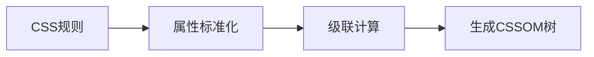
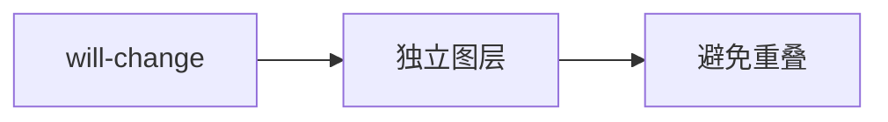

## 一、核心渲染流程

## 二、详细分步解析

### 1. 网络请求 HTML 与解析

- HTML 文件在网络中传输的内容其实都是 0 和 1 这些字节数据。当浏览器接收到这些字节数据以后，转换为字符串，也就是我们写的代码。
- 浏览器将这些字符串通过词法分析转换为标记（token），这一过程在词法分析中叫做标记化（tokenization）
- 当结束标记化后，这些标记会紧接着转换为 Node，最后这些 Node 会根据不同 Node 之前的联系构建为一颗 DOM 树。

![[Pasted image 20250616020031.png]]

- **关键过程**：
  - 边下载边解析（渐进式解析）
  - 遇到 `<script>` 会阻塞解析（除非标记 `async/defer`）
  - 遇到 `<link rel="stylesheet">` 并行下载 CSS

### 2. 样式计算（CSSOM 构建）

- **特性**：
  - CSS 选择器从右向左匹配
    - 从右开始可以更早确定该元素位置，向上一路找父亲节点就好
    - 要避免节点层级过多
  - `!important` > 行内样式 > ID > Class > 标签

![[Pasted image 20250616020040.png]]

### 3. 渲染树合成

- **排除元素**：
  - `display: none`
  - `<head>` 等不可见标签
  - 未加载的懒加载内容

![[Pasted image 20250616015941.png]]

### 4. 布局（Layout/Reflow）

- **计算内容**：
  - 元素尺寸/位置
  - 视口大小相关单位（vw/vh）
  - 浮动/定位处理

    当影响**几何属性**的变化发生时，会触发回流，重新从布局阶段开始：(所以要尽量避免)
    - 修改元素尺寸、位置（width/height）
    - 改变窗口大小（resize）
    - 操作 DOM 结构（添加/删除节点）
    - 取布局信息（offsetTop 等）
    - 定位或者浮动
    - 改变盒模型

### 5. 分层与绘制（Paint）

- **优化策略**：
  - 合成层（will-change/transform）
  - 避免 " 层爆炸 "
  - 分块光栅化（viewport 优先）

    当只影响**外观属性**的变化发生时，会触发重绘：
    - 修改 color/background-color
    - 调整 outline/box-shadow
    - visibility 变化（不改变布局）

### 6. 合成显示（Composite）

- **VSync 信号**：（这个其实是一帧的开始）
  - 60Hz 屏幕每 16.6ms 刷新一次
  - 不满足则掉帧（jank）

## 三、关键优化点

### 1. 阻塞渲染的解决方案

- 关键 CSS：内联头部
- 关键 JS：异步加载

### 2. 减少重排/回流（Reflow）

- 分离读写：大部分读不会导致回流
- 批量修改：比如 100 个节点添加，先加到一个结构里，最后一次 append 到 DOM 上
- 使用 transform 代替 top 等
- 使用 `visibility` 替换 `display: none`
- 动画实现的速度选择，动画速度越快，回流次数越多；也可以选择使用 `requestAnimationFrame`

### 3. 提升合成效率

## 注意事项

### 如何衡量 DOM 加载完成

document.readyState 来表示文档的当前状态

- loading: 文档正在载入
- interactive: DOM 已被解析完毕，但是诸如图像，样式表和框架之类的子资源仍在加载
  - 即将触发 **document.DOMContentLoaded** 事件 **【生成渲染树完毕】** 👈
- complete: 文档和所有子资源已完成加载
  - 即将触发 **window.onload** **【页面完全加载完毕】**

> Q: 什么情况会阻塞 DOM 加载

### 外链资源会阻塞 DOM 加载吗

在解析 HTML 的过程中，会遇到需要加载的其他资源，可以划分为 JS/CSS/ 图片三种类型，特点如下：

- CSS 资源
  - 异步下载，并行解析 CSS，所以下载和解析都**不会阻塞**主线程构建 dom 树
  - `<link href='./style.css' rel='stylesheet'/>`
- JS 资源
  - 同步下载，同步执行，下载和执行**都会阻塞**构建 dom 树
  - `<script src='./index.js'/>`
- 图片资源
  - 异步下载，下载完成后替换原来的 img 标签的 src，**不会阻塞**构建 dom 树

因为这样的特性，往往推荐将 CSS 样式表放在 head 头部，js 文件放在 body 尾部，使得渲染能尽早开始。

### javascript 阻塞 DOM 加载：使用 defer、ayncs 优化

GUI 线程和 JS 引擎线程是互斥的，因为 javascript 可能操纵 dom。如果过早引入 js 文件，会阻塞渲染。

> 注意本图是指 css/dom 不依赖 JS 的理想情况下

![[Pasted image 20250616010850.png|400]]

- 没有 defer 或 async
  - 浏览器遇到 script 标签会立即下载、并执行脚本
  - 串行下载、串行执行 JS
  - 加载多个 JS 脚本时，会按照顺序下载和执行
- async 属性：
  - 表示异步执行引入的 JavaScript
  - 后台并行下载 JS，JS 一经下载好，就会交回主线程立即执行
  - 加载多个 JS 脚本时，由于下载完成时间不一样，执行是无顺序的
- **defer** 属性
  - 表示延迟执行引入的 JavaScript
  - 后台并行下载 JS，即使下载好了，也会延迟到 DOM 树构建完毕执行
  - 加载多个 JS 脚本时，会按照顺序下载和执行

![[Pasted image 20250616010936.png|400]]

---

---

- js：阻塞 DOM 解析和渲染
  - 解析 DOM 树时，如果遇到 JavaScript 代码，就会停下来解析相应的 JavaScript 代码，此时 HTML 文档树会被阻塞，这是因为 JavaScript 可能会对 HTML 造成一定的影响。
  - 假如我们在 js 里面对 DOM 树上的元素样式进行了操作，那实际上，我们是需要 CSSOM 对象才能做到

但是在 JavaScript 解析之前，我们无法得知这段 JavaScript 代码是否对样式进行了操作，所以渲染引擎在遇到 JavaScript 的时候，不管脚本是否操纵了 CSSOM，都会执行 css 文件下载，解析生成 CSSOM，再去解析 JavaScript，所以**JavaScript 是依赖样式**的

- css：会阻塞渲染，不一定会阻塞解析（在没有 js 代码时不会阻塞，有 js 代码时阻塞，因为 js 代码的执行，依赖 CSSOM 树）
- 当只有外部 css 文件时，css 不会阻塞解析

![[Pasted image 20250616022505.png]]

- 当引入 css 外部文件同时写入**内联**JavaScript 时，解析时遇到 Js 代码，会停下来解析这段 Js 代码，这时页面又引入外部的 css 文件，而**JavaScript 代码的执行，受 CSSOM 树构建的阻塞**，所以就导致了，在遇到 JavaScript 的时候，DOM 解析停下了，而要解析 JavaScript 的时候，又因有外部 css 文件的下载，CSSOM 树没构建好，而导致 JavaScript 解析被阻止了，所以导致了 DOM 树构建被阻塞了，这也就是，CSS 阻塞 DOM 解析的情况了

![[Pasted image 20250616022519.png]]

- 同时引用 css 文件和 js 文件

![[Pasted image 20250616022537.png]]
